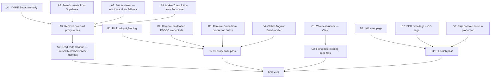

# Torque — Final Wrap-Up Plan

**Created:** 2026-03-26  
**Goal:** Ship a production-ready application with no Motor runtime dependency for normalized vehicles, hardened security, and polished UX.

---

## Dependency diagram

---

## Track A — Motor Phase-Out (Highest Priority)

### A1: YMME reads — Supabase-only with seeded cache

**Priority:** Highest  
**Files:** `vehapiproxi/src/function.js`, `src/pages/home/home.component.ts`, `vehapiproxi/src/supabase.js`  
**Current state:** `metadataCacheMiddleware` serves `vehicle_metadata` if a row exists; cache miss falls through to live Motor proxy. Home page calls `/api/years`, `/api/year/:y/makes`, `/api/year/:y/make/:make/models`.  
**Target:**
- Seed `vehicle_metadata` with full YMME data (years + makes + models for all years) via a one-time ingest script.
- After seeding, the middleware always serves from Supabase; the Motor proxy path becomes repair-only (admin flag or explicit header).
- Add a staleness TTL check (e.g. 90 days) so YMME refreshes periodically rather than on every miss.

**Acceptance:** Home page year/make/model cascade loads from Supabase with no Motor HTTP when `vehicle_metadata` rows exist for those paths.

---

### A2: Search results / article catalog — Supabase-only for normalized vehicles

**Priority:** Highest  
**Files:** `src/services/search-results.state.ts`, `vehapiproxi/src/function.js` (articlesCacheMiddleware)  
**Current state:** `SearchResultsState` calls `motorApi.getSearchResultsByVehicleId()` which hits the proxy → Motor `articles/v2` (unless `articlesCacheMiddleware` intercepts). The cache middleware requires `is_normalized` + `count >= ARTICLE_CATALOG_MIN_ROWS`.  
**Target:**
- `SearchResultsState` should check whether the vehicle is normalized and, if so, query Supabase `articles` directly (via `DataSyncService` or a new method) instead of calling the proxy.
- Proxy `articles/v2` cache middleware already handles the backend side; the frontend should short-circuit entirely for normalized vehicles.
- Keep Motor path for non-normalized vehicles only.

**Acceptance:** For normalized vehicles, the browse/search tabs load article lists without any Motor HTTP request from the frontend.

---

### A3: Article viewer — eliminate Motor content fallback for normalized vehicles

**Priority:** High  
**Files:** `src/pages/article-viewer/article-viewer.component.ts`  
**Current state:** `loadDataWithSupabaseFirst` checks Supabase then falls back to `fetchContentFromMotor`. Also calls `getArticleMetadata` (Motor) for `moduleType` and `getArticleTitle` (Motor) when title is missing.  
**Target:**
- For normalized vehicles: if Supabase has no body, trigger lazy ingest (`syncSingleArticle`) and wait for it, then re-read Supabase — do not call Motor from the browser.
- Resolve `moduleType` from Supabase `articles` row (`bucket`, `parent_bucket`, or `content_item.kind`) instead of calling `getArticleMetadata`.
- Resolve title from Supabase `articles.title` (already partially done); remove `fetchTitleFromMotor` for normalized vehicles.

**Acceptance:** Normalized vehicle article viewer makes zero Motor HTTP calls. Non-normalized vehicles still use the fallback.

---

### A4: Numeric make-ID resolution — cache in `vehicle_metadata`

**Priority:** Medium  
**Files:** `vehapiproxi/src/routes/make-id-resolution.js`  
**Current state:** When `:make` is numeric, the route fetches makes from Motor to resolve the ID to a name, then fetches models. This is a live Motor round-trip on every numeric-make request.  
**Target:**
- Check `vehicle_metadata` for the `/api/year/:y/makes` path first; resolve numeric make from the cached list.
- Only fetch from Motor if the cache is missing (same seeding from A1 covers this).

**Acceptance:** Numeric make resolution uses Supabase `vehicle_metadata` when available.

---

### A5: Proxy — restrict Motor pass-through to ingest-only paths

**Priority:** High (after A1–A4)  
**Files:** `vehapiproxi/src/function.js`  
**Current state:** Catch-all `app.use('/', authMiddleware, createProxyMiddleware(...))` proxies every unmatched path to Motor.  
**Target:**
- Add an allowlist of paths that should still reach Motor (graphics/binaries, explicit ingest headers, non-normalized vehicle requests).
- Return 404/410 for paths that should be served from Supabase but have no data (triggers ingest rather than transparent Motor passthrough).
- Log/alert when the catch-all proxy is used unexpectedly (canary for missed migration).

**Acceptance:** No Motor proxy traffic for paths covered by Supabase for normalized vehicles. Unrecognized paths return structured errors instead of silently proxying.

---

### A6: Dead code cleanup

**Priority:** Low (after A1–A5)  
**Files:** `src/services/motor-api.service.ts`, `src/services/vehicle-data.service.ts`  
**Current state:** ~20 `MotorApiService` methods are never called from `src/`. `loadFromSearch` in `VehicleDataService` is dead. `PartsSectionComponent` imports `MotorApiService` but never uses it.  
**Target:**
- Remove or deprecate unused methods from `MotorApiService`.
- Remove `loadFromSearch` from `VehicleDataService`.
- Remove unused `MotorApiService` injection from `PartsSectionComponent`.

**Acceptance:** No dead Motor-related code in the frontend.

---

## Track B — Security & Production Hardening

### B1: RLS policy tightening

**Priority:** High  
**Files:** `supabase_schema.sql`, new migration SQL  
**Current state:** 20 tables have `FOR ALL … USING (true) WITH CHECK (true)` — any authenticated user can read/write any row.  
**Target:**
- **Read-only for anon/authenticated** on vehicle/article/catalog tables (vehicles, articles, procedures, dtcs, tsbs, specifications, spec_fact, categories, parts, maintenance_schedules, maintenance_task, canonical_bucket, bucket_alias, common_issues_cache, vehicle_metadata).
- **Owner-scoped writes** on user-facing tables (users, transactions) — `USING (auth.uid() = user_id)`.
- **Deny all** for anon/authenticated on internal tables (evidence_ingest, evidence_link, content_item, media_asset, content_chunk, ai_processing_logs, failed_extractions) — service role only.
- Generate idempotent migration SQL.

**Acceptance:** No table allows arbitrary writes from the browser. Service-role operations (proxy, worker) are unaffected by RLS.

---

### B2: Remove hardcoded EBSCO credentials

**Priority:** Critical  
**Files:** `vehapiproxi/src/auth.js` (line ~280)  
**Current state:** EBSCO username and password are hardcoded in a URL string.  
**Target:**
- Move to environment variables (`EBSCO_USER`, `EBSCO_PASSWORD` — already in `.env.example`).
- Construct the login URL dynamically.
- Rotate the exposed credentials in the Motor/EBSCO portal.

**Acceptance:** No credentials in tracked source files. `.env.example` documents the variables.

---

### B3: Remove Eruda from production builds

**Priority:** High  
**Files:** `package.json` (build script), `randdev/scripts/inject-eruda.cjs`, `index.html`  
**Current state:** `npm run build` runs `inject-eruda.cjs` which injects mobile dev tools into `dist/index.html`. Eruda script tag also exists in source `index.html`.  
**Target:**
- Remove the `inject-eruda.cjs` call from the production build command.
- Remove or conditionally load Eruda only when `?eruda=true` query param is present or in non-production environments.
- Keep `inject-eruda.cjs` available as a manual dev tool (`npm run inject-eruda`).

**Acceptance:** Production build output contains no Eruda script. Dev can opt-in via separate command.

---

### B4: Global Angular ErrorHandler

**Priority:** Medium  
**Files:** `src/app.component.ts`, `index.tsx`  
**Current state:** Bootstrap only has `.catch(console.error)`. No `ErrorHandler` provider. Narrow `unhandledrejection` listener suppresses only AbortError.  
**Target:**
- Provide a custom `ErrorHandler` that logs to a structured service (or at minimum to `console.error` with context) and shows a toast/snackbar for unexpected errors.
- Catch unhandled Observable errors via a global RxJS error handler or ensure all subscribe sites have error callbacks.

**Acceptance:** Unhandled errors don't crash the app silently; users see a recoverable error message.

---

### B5: Security audit pass

**Priority:** Medium (after B1–B4)  
**Target:**
- Verify no secrets in git history (or document rotation needs).
- Confirm CORS allowlist in `function.js` matches production domains only.
- Verify CSP headers are set (or document the gap).
- Confirm auth tokens have appropriate expiry and refresh.

---

## Track C — Testing

### C1: Wire a test runner (Vitest)

**Priority:** Medium  
**Files:** `angular.json`, `package.json`, new `vitest.config.ts`  
**Current state:** 15 spec files exist but no runner is configured. No `test` script.  
**Target:**
- Add Vitest (or Jest with Angular presets) as the test runner.
- Configure `angular.json` test architect (or standalone Vitest config).
- Add `npm test` script.
- Verify at least one spec file runs green.

**Acceptance:** `npm test` executes spec files and reports results.

---

### C2: Fix/update existing spec files

**Priority:** Low (after C1)  
**Target:**
- Update spec files to work with current component APIs (signals, standalone).
- Add critical-path specs: auth flow, credit unlock, article loading (Supabase-first path).
- Target: 80%+ coverage on services, basic smoke tests on page components.

**Acceptance:** All existing specs pass; critical-path specs added.

---

## Track D — UX Polish

### D1: 404 / Error page

**Priority:** Medium  
**Files:** `index.tsx` (routes), new `src/pages/not-found/`  
**Current state:** `{ path: '**', redirectTo: '' }` silently sends unknown URLs to home.  
**Target:**
- Create a `NotFoundComponent` with design-system styling, a message, and a "Go Home" button.
- Replace the `**` redirect with `{ path: '**', component: NotFoundComponent }`.

**Acceptance:** Unknown routes show a branded 404 page.

---

### D2: SEO meta tags + Open Graph

**Priority:** Medium  
**Files:** `index.html`, `src/app.component.ts` or route-level components  
**Current state:** No `<meta name="description">`, no OG tags, no dynamic titles.  
**Target:**
- Add static meta description and OG tags in `index.html` for the default/home page.
- Use Angular `Title` service to set dynamic `<title>` per route (e.g. "2019 Ford F-150 — TORQUE.AI").
- Add `og:title`, `og:description`, `og:image` (static app icon) meta tags.

**Acceptance:** Social share previews show app name, description, and image. Each route has a relevant page title.

---

### D3: Strip console noise in production

**Priority:** Low  
**Files:** Multiple services and components  
**Current state:** `console.error`/`console.warn` calls run unconditionally in production. `MotorApiService` verbose logging is already gated.  
**Target:**
- Create a lightweight `LoggerService` that respects `environment.production` — suppresses debug/info, keeps error/warn.
- Replace direct `console.*` calls in services with `LoggerService`.
- Alternatively: add a build-time Terser plugin to strip `console.log`/`console.debug` (keep `.error`/`.warn`).

**Acceptance:** Production browser console is clean of debug noise. Errors still logged.

---

## Track E — Maintenance & Ops (Low Priority)

### E1: Maintenance ingest — OEM label resolution

**Priority:** Low  
**Files:** `src/utils/maintenance-response.util.ts`, `vehapiproxi/src/background_worker.js`  
**Current state:** Interval/frequency parsing works; `maintenanceScheduleId` / `applicationID` stored in `maintenance_task.metadata_json` but not resolved to OEM labels.  
**Target:** If Motor exposes a schedule detail endpoint, resolve IDs to human-readable labels. Otherwise, document as a known limitation.

### E2: Commit Cursor hooks/agents to repo

**Priority:** Low  
**Files:** `.cursor/hooks.json`, `.cursor/hooks/*.mjs`, `.cursor/WORKER_LOOP.md`, `.cursor/agents/*`  
**Target:** Add to version control when the team should share Cursor auto-continue/orchestrator config.

### E3: Deploy verification baseline — fill prod deploy columns

**Priority:** Low  
**Files:** `PROGRESS.md` (Deploy verification baseline table)  
**Target:** After next production deploy, record Vercel deployment IDs in the table.

---

## Execution order (recommended)

| Phase | Tasks | Estimated effort |
|-------|-------|-----------------|
| **Phase 1 — Security** | B2 (EBSCO creds), B3 (Eruda), B1 (RLS) | ~2–3 hours |
| **Phase 2 — Motor kill switch** | A1 (YMME seed), A2 (search from Supabase), A3 (article viewer), A4 (make-ID) | ~4–6 hours |
| **Phase 3 — Proxy lockdown** | A5 (restrict catch-all), A6 (dead code) | ~2 hours |
| **Phase 4 — UX/DX** | D1 (404 page), D2 (SEO), B4 (ErrorHandler), D3 (console strip) | ~2–3 hours |
| **Phase 5 — Testing** | C1 (wire Vitest), C2 (fix specs) | ~3–4 hours |
| **Phase 6 — Ops** | B5 (security audit), E1–E3 | ~1–2 hours |

**Total estimated:** ~14–20 hours of focused development.

---

## Success criteria for "v1.0 shipped"

1. Normalized vehicles make **zero** Motor HTTP calls for YMME, article catalog, article content, search, or section data.
2. No hardcoded credentials in tracked files.
3. RLS policies enforce least-privilege (read-only client, service-role for writes).
4. No dev tools (Eruda) in production builds.
5. `npm test` runs and passes.
6. Unknown routes show a 404 page.
7. Social share previews work (OG tags).
8. Production console is clean.
