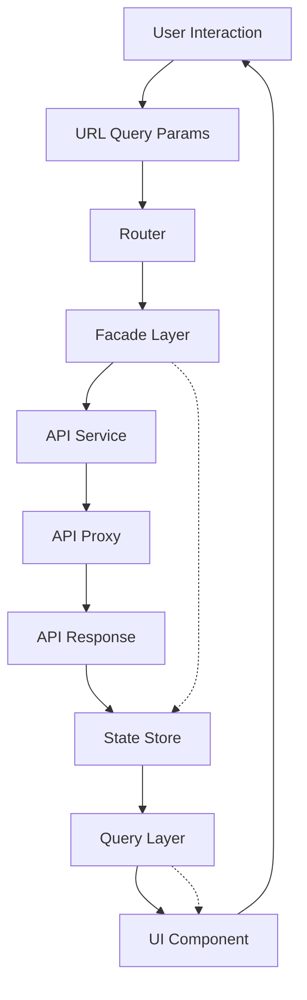

# Vehicle Service API Frontend - Implementation Guide

**Version**: 1.0  
**Last Updated**: 2025-12-30  
**Purpose**: Comprehensive guide for recreating the Vehicle Service API frontend application in any programming language or framework

## Table of Contents

1. [Introduction & Architecture](#1-introduction--architecture)
2. [API Integration Setup](#2-api-integration-setup)
3. [Mobile-First Design Requirements](#3-mobile-first-design-requirements-critical)
4. [AI-Powered Content Rewriting System](#4-ai-powered-content-rewriting-system-critical)
5. [AI-Generated Stepper Tutorials](#5-ai-generated-stepper-tutorials-critical)
6. [State Management Architecture](#6-state-management-architecture)
7. [Core Data Models](#7-core-data-models)
8. [Routing & URL State Management](#8-routing--url-state-management)
9. [Search Functionality](#9-search-functionality)
10. [Categorization & Bucketing Logic](#10-categorization--bucketing-logic)
11. [Article Display System](#11-article-display-system)
12. [Vehicle Selection Flow](#12-vehicle-selection-flow)
13. [Maintenance Schedules](#13-maintenance-schedules)
14. [Parts Management](#14-parts-management)
15. [Labor Operations](#15-labor-operations)
16. [Bookmarks](#16-bookmarks)
17. [UI Component Patterns](#17-ui-component-patterns)
18. [User Settings System](#18-user-settings-system)
19. [Error Handling](#19-error-handling)
20. [Performance Optimizations](#20-performance-optimizations)
21. [Special Features](#21-special-features)
22. [Data Processing Algorithms](#22-data-processing-algorithms)
23. [Implementation Checklist](#23-implementation-checklist)
24. [Testing Considerations](#24-testing-considerations)
25. [Appendix](#25-appendix)

## 1. Introduction & Architecture

### 1.1 Application Overview

The Vehicle Service API Frontend is a comprehensive web application for accessing vehicle service information, including:
- Technical service articles and procedures
- Maintenance schedules
- Parts catalogs
- Labor operations
- Diagnostic information
- Vehicle-specific documentation

**CRITICAL REQUIREMENT**: The application must be **mobile-first** with **AI-powered content rewriting** and **interactive stepper tutorials**.

### 1.2 Architecture Patterns

The application follows a **reactive, state-driven architecture** using:

- **State Management Pattern**: Centralized state stores with derived queries
- **Facade Pattern**: Simplified API access layer that orchestrates state updates
- **Query Pattern**: Computed/derived state from stores
- **Reactive Programming**: Observable streams for data flow
- **URL-as-State**: URL query parameters as single source of truth

### 1.3 Data Flow Architecture



### 1.4 Key Architectural Components

1. **Facades** - Orchestrate API calls and state updates, provide public API for components
2. **Stores** - Hold application state (EntityStore for collections, Store for objects)
3. **Queries** - Compute derived state from stores, provide observable streams
4. **API Services** - Type-safe HTTP client wrappers
5. **Components** - Present data using observables, handle user interactions

### 1.5 Technology-Agnostic Design Principles

- **Separation of Concerns**: Clear boundaries between data, logic, and presentation
- **Reactive Patterns**: Use observable/stream patterns available in your framework
- **Type Safety**: Strong typing for API contracts and data models
- **State Management**: Centralized state with predictable updates
- **URL-Driven**: All significant state reflected in URL parameters
- **Mobile-First**: Design for mobile, enhance for larger screens

## 2. API Integration Setup

### 2.1 API Base Configuration

**CRITICAL**: The application uses a pre-authenticated proxy endpoint:

- **Base URL**: `https://us-central1-vehapi-torque.cloudfunctions.net/motorApiAuthProxy/`
- **Authentication**: Handled by the proxy (no API keys required in application)
- **Protocol**: HTTPS only
- **Content-Type**: `application/json` for request/response bodies

### 2.2 HTTP Client Setup

Configure your HTTP client to:
- Use the proxy base URL for all API requests
- Include standard headers:
  - `Content-Type: application/json` (for POST/PUT requests)
  - `Accept: application/json`
- Handle CORS (should be handled by proxy)
- Support request/response interception for error handling

### 2.3 Request/Response Patterns

All API requests follow RESTful conventions:

**Request Pattern**:
```
{HTTP_METHOD} {proxyBaseUrl}/api/{resource}/{pathParams}?{queryParams}
```

**Response Pattern**:
- Success: HTTP 200 with JSON body
- Error: HTTP 4xx/5xx with error details
- Binary content (images, PDFs): HTTP 200 with appropriate content-type

**IMPORTANT - API Response Structure**:
The API wraps all responses in a structure with `header` and `body` properties:
```json
{
  "header": {
    "messages": [],
    "date": "RFC 1123 date string",
    "status": "OK",
    "statusCode": 200
  },
  "body": [actual data here]
}
```

When using HTTP client libraries (like Angular's HttpClient), the parsed JSON response body will be this wrapper object. Access the actual data via the `body` property:
- List responses: `response.body` contains the array directly
- Object responses: `response.body` contains the object with its properties
- Examples:
  - Years endpoint: `response.body` is `[1985, 1986, ...]`
  - Makes endpoint: `response.body` is `[{makeId: 2, makeName: "Porsche"}, ...]`
  - Models endpoint: `response.body` is `{contentSource: "Toyota", models: [...]}`

### 2.4 Error Handling at API Level

- **Network Errors**: Handle connection failures gracefully
- **HTTP Errors**: Map status codes to user-friendly messages
- **Timeout Handling**: Set appropriate timeouts for mobile connections
- **Retry Logic**: Consider retry for transient failures (network issues)
- **Error Logging**: Log errors for debugging (without exposing sensitive data)

### 2.5 Content-Type Handling

The API returns various content types:
- **JSON**: Standard API responses
- **Image/Binary**: Graphics, images (use appropriate content-type headers)
- **PDF**: Base64-encoded PDFs in JSON responses
- **HTML**: Article content as HTML strings in JSON

## 3. Mobile-First Design Requirements (CRITICAL)

### 3.1 Screen Space Maximization

#### 3.1.1 Viewport Configuration

- **Full Viewport Usage**: 
  - Use `100vw` and `100vh` for full screen utilization
  - Support safe area insets for notched devices (iOS, Android)
  - Use CSS `env(safe-area-inset-*)` variables
  - Test on various device form factors

- **No Wasted Space**:
  - Avoid fixed headers/footers that take up screen real estate
  - Use collapsible navigation elements
  - Implement overlay modals instead of separate pages
  - Hide UI chrome when reading content (full-screen mode)

#### 3.1.2 Layout Principles

- **Single-Column Layouts**: 
  - Primary layout should be single column for mobile
  - Multi-column layouts only for tablet/desktop (progressive enhancement)

- **Navigation Patterns**:
  - Bottom navigation bar (thumb-accessible, persistent)
  - Drawer/slide-out menus (hide until needed)
  - Swipe gestures for navigation (back, between tabs)
  - Floating action buttons for key actions (positioned for thumb reach)

- **Content Display**:
  - Full-screen article viewing (hide navigation when reading)
  - Sticky headers only when necessary (collapsible on scroll)
  - Progressive disclosure (show more on demand)
  - Infinite scroll for long lists

#### 3.1.3 Typography & Spacing

- **Touch-Friendly Targets**:
  - Minimum 44x44px touch targets (Apple HIG recommendation)
  - Adequate spacing between interactive elements (minimum 8px)
  - No overlapping touch targets

- **Readability**:
  - Font sizes optimized for mobile (minimum 16px for body text)
  - Line height: 1.5-1.6 for comfortable reading
  - High contrast for text on backgrounds
  - Support for dynamic text sizing (accessibility)

- **Space Optimization**:
  - Reduced padding/margins to maximize content area
  - Responsive spacing that scales with screen size
  - Use CSS `clamp()` for fluid typography

#### 3.1.4 Content Display Strategies

- **Progressive Disclosure**: 
  - Collapsible sections (accordions, expandable cards)
  - "Show More" patterns for long content
  - Tabbed interfaces for related content

- **Loading Patterns**:
  - Skeleton screens for better perceived performance
  - Pull-to-refresh for content updates
  - Infinite scroll for paginated content

- **Media Optimization**:
  - Lazy loading for images (load on viewport entry)
  - Responsive images (serve appropriate sizes)
  - PDF viewing in full-screen mode
  - Video/content embedding that adapts to viewport

### 3.2 Mobile-Specific UI Patterns

#### 3.2.1 Bottom Sheet Pattern

- Use for secondary actions, filters, selections
- Slides up from bottom (thumb-accessible)
- Backdrop overlay with tap-to-dismiss
- Smooth animations (material design style)

#### 3.2.2 Gesture-Based Navigation

- **Swipe Back**: Navigate to previous screen
- **Swipe Between Tabs**: Horizontal swipe for tab navigation
- **Pull-to-Refresh**: Vertical pull gesture to refresh content
- **Long Press**: Context menus, item selection

#### 3.2.3 Haptic Feedback

- Provide tactile feedback for key interactions:
  - Button presses
  - Successful actions
  - Error states
  - Navigation transitions

#### 3.2.4 Adaptive Layouts

- **Portrait Optimization**: 
  - Vertical scrolling primary
  - Stack content vertically
  - Bottom navigation

- **Landscape Optimization**:
  - Utilize wider screen
  - Consider split-view for certain content
  - Maintain readability

#### 3.2.5 Touch-Optimized Controls

- Larger hit areas for touch targets
- Visual feedback on touch (active states)
- Prevent accidental touches (debouncing, confirmation dialogs)
- Support for touch gestures (pinch, swipe, long-press)

#### 3.2.6 Mobile Keyboard Handling

- Scroll input fields into view when keyboard appears
- Adjust layout to accommodate keyboard
- Dismiss keyboard appropriately (scroll, tap outside)
- Support "Done" button on keyboard

### 3.3 Mobile-First CSS Approach

- **Base Styles**: Mobile-first (no media queries for base)
- **Progressive Enhancement**: Media queries for larger screens (`@media (min-width: ...)`)
- **Fluid Typography**: Use `clamp()`, `vw` units, or CSS custom properties
- **Flexible Layouts**: Flexbox and Grid with appropriate fallbacks
- **Performance**: Minimize CSS, use efficient selectors, avoid expensive properties

## 4. AI-Powered Content Rewriting System (CRITICAL)

### 4.1 Content Rewriting Requirements

**CRITICAL REQUIREMENT**: ALL text content from the API must be rewritten using AI to avoid plagiarism.

#### 4.1.1 Text Content Scope

The following content must be AI-rewritten:
- Article HTML text content (paragraphs, headings, lists)
- Article titles
- Descriptions and summaries
- Instructions and procedures
- Diagnostic information
- Safety warnings and cautions
- Any textual metadata (if displayed to users)
- Image alt text (if present)

#### 4.1.2 Content Preservation Rules

The following content must remain UNTOUCHED:
- **PDF Files**: Use original PDFs as-is (no modification)
- **Images/Graphics**: Use original images as-is (no modification, no watermarking)
- **Metadata**: IDs, codes, part numbers, technical specifications (preserve exactly)
- **Structured Data**: Tables, lists structure (preserve structure, rewrite text content)

**Note**: While images/PDFs remain untouched, they should be placed appropriately in the AI-revised article context.

### 4.2 AI Rewriting Process

#### 4.2.1 Content Extraction

1. **Parse HTML Structure**:
   - Parse HTML content from API response
   - Maintain DOM structure and hierarchy
   - Identify text nodes vs. media elements

2. **Separate Content Types**:
   - Extract text nodes separately from images/PDFs
   - Identify structured content (headings, lists, paragraphs, tables)
   - Preserve content hierarchy/structure
   - Track position of media elements relative to text

3. **Content Segmentation**:
   - Break content into logical segments (paragraphs, list items, etc.)
   - Maintain relationships between segments
   - Preserve formatting markers (bold, italic, links)

#### 4.2.2 AI Rewriting Pipeline

```
Original API Text → Extract Text Nodes → AI Rewriter → Rewritten Text → Merge with Media → Transform Tags → Final HTML
```

**AI Rewriting Requirements**:
- Maintain technical accuracy (domain-specific terminology)
- Preserve original meaning and intent
- Maintain step sequence (for procedures)
- Preserve safety warnings and cautions
- Keep formatting structure (headings, lists, tables)
- Maintain semantic relationships
- Use active voice where appropriate
- Improve clarity without changing meaning

**Example Rewriting**:
```
Original: "Remove the bolt using a 10mm socket wrench."
Rewritten: "Use a 10mm socket wrench to remove the bolt."
```

#### 4.2.3 Content Merging

1. **Re-insert Original Media**:
   - Place images at appropriate positions in rewritten text
   - Maintain original image-to-text relationships
   - Ensure images appear near relevant rewritten text
   - Preserve image captions (rewrite caption text, keep image unchanged)

2. **PDF Integration**:
   - Maintain PDF references/embeds
   - Place PDF embeds at appropriate positions
   - Preserve PDF context in surrounding rewritten text

3. **Structure Preservation**:
   - Maintain heading hierarchy
   - Preserve list structures (ordered, unordered)
   - Keep table structures (rewrite cell content, preserve structure)
   - Maintain link relationships (update link text if needed, preserve URLs)

### 4.3 Implementation Considerations

#### 4.3.1 Client-Side vs. Server-Side

**Client-Side Rewriting**:
- Pros: No server infrastructure needed, real-time rewriting
- Cons: Requires API key in client (security concern), slower (each user triggers rewriting), increased client bundle size
- Use Case: Development, small-scale deployments

**Server-Side Rewriting**:
- Pros: Faster (centralized processing), secure (API keys on server), caching possible
- Cons: Requires server infrastructure, proxy modification needed
- Use Case: Production deployments, better performance

**Recommendation**: Server-side rewriting is preferred for production.

#### 4.3.2 Caching Strategy

- **Cache Key**: Use article ID + content version/hash as cache key
- **Cache Duration**: Cache rewritten content (consider article update frequency)
- **Cache Invalidation**: Invalidate when article content changes
- **Storage**: Server-side cache (Redis, database) or client-side (localStorage for recently viewed)

#### 4.3.3 Fallback Strategy

- If AI rewriting fails:
  - Show original content with warning/indicator
  - Log error for debugging
  - Allow user to retry rewriting
  - Consider graceful degradation

#### 4.3.4 Performance Optimization

- **Batch Processing**: Rewrite multiple articles in batch (if server-side)
- **Async Processing**: Show loading state while rewriting
- **Progressive Enhancement**: Show original content, then replace with rewritten
- **Lazy Rewriting**: Rewrite on-demand (when article is viewed), not pre-rewrite all
- **Optimize for Mobile**: Consider mobile data speeds, minimize API calls

### 4.4 Technical Implementation Patterns

#### 4.4.1 Async Rewriting Pattern

```pseudocode
function displayArticle(articleId) {
    showLoadingState();
    
    fetchArticle(articleId)
        .then(article => {
            showOriginalContent(article); // Progressive enhancement
            
            return rewriteContent(article.html);
        })
        .then(rewrittenHtml => {
            updateContent(rewrittenHtml);
            hideLoadingState();
        })
        .catch(error => {
            showOriginalContent(article); // Fallback
            logError(error);
            hideLoadingState();
        });
}
```

#### 4.4.2 AI Service Integration

- **Service Options**:
  - OpenAI (GPT models)
  - Anthropic (Claude)
  - Local LLM (Llama, Mistral, etc.)
  - Other AI services

- **API Integration**:
  - REST API calls to AI service
  - Proper prompt engineering (see Appendix)
  - Rate limiting and error handling
  - Cost optimization (token usage)

#### 4.4.3 Prompt Engineering for Rewriting

**Basic Prompt Structure**:
```
Rewrite the following technical content while maintaining:
- Technical accuracy
- Original meaning and intent
- Step sequence (if procedures)
- Safety warnings
- Formatting structure

Original content:
{CONTENT_TO_REWRITE}
```

**Advanced Considerations**:
- Domain-specific instructions (automotive terminology)
- Tone and style guidelines
- Length constraints (if needed)
- Language/locale support

---

## 5. AI-Generated Stepper Tutorials (CRITICAL)

### 5.1 Stepper Tutorial System Overview

**CRITICAL REQUIREMENT**: Generate interactive step-by-step tutorials from article content using AI.

- Tutorials guide users through procedures, diagnostics, repairs
- Based ONLY on article data retrieved from API (after AI rewriting)
- AI analyzes article structure and creates tutorial steps
- Mobile-optimized stepper interface

### 5.2 Tutorial Generation Process

#### 5.2.1 Article Analysis

1. **Parse Article Content**:
   - Use AI-rewritten article content
   - Parse HTML structure
   - Identify content type (procedure, diagnostic, installation, inspection)

2. **Identify Procedural Elements**:
   - Detect numbered lists (steps)
   - Extract headings hierarchy
   - Identify key actions and decision points
   - Find images/diagrams and their positions
   - Detect conditional logic (if/then scenarios)
   - Identify warnings and cautions

3. **Determine Logical Flow**:
   - Map step dependencies
   - Identify branching points
   - Determine sequential vs. parallel steps
   - Extract prerequisites

#### 5.2.2 Step Extraction

Break down procedures into discrete steps:

**Step Criteria**:
- **Actionable**: Clear action for user to perform
- **Self-Contained**: Understandable in isolation
- **Sequentially Ordered**: Logical progression
- **Linked to Media**: Associated images/diagrams

**Step Types**:
1. **Action Steps**: User performs an action
2. **Verification Steps**: User verifies/checks something
3. **Decision Steps**: User makes a decision (branching)
4. **Information Steps**: Informational content (context)

#### 5.2.3 Tutorial Structure

```typescript
interface Tutorial {
    id: string;                    // Generated from article ID
    articleId: string;             // Source article ID
    title: string;                 // AI-generated from article title
    overview: string;              // AI-generated summary
    estimatedTime: number;         // AI-estimated minutes
    difficulty?: string;           // AI-assessed difficulty (optional)
    prerequisites?: string[];      // AI-extracted prerequisites
    steps: Step[];
    metadata: {
        generatedAt: Date;
        articleVersion: string;
        tutorialVersion: string;
    };
}

interface Step {
    stepNumber: number;
    title: string;                 // AI-generated step title
    instruction: string;           // AI-rewritten instruction
    images: Image[];               // From original article
    warnings?: string[];           // AI-extracted safety warnings
    cautions?: string[];           // AI-extracted cautions
    checkpoints?: string[];        // AI-generated verification points
    nextStepCondition?: string;    // Condition for branching (if applicable)
    estimatedTime?: number;        // AI-estimated minutes for this step
    toolsRequired?: string[];      // AI-extracted tools/parts
}
```

#### 5.2.4 AI Generation Rules

**Step Title Generation**:
- Clear, concise (5-10 words)
- Action-oriented ("Remove Battery", "Check Fluid Level")
- Use imperative mood

**Instruction Rewriting**:
- Active voice
- Clear, direct language
- Include specific details (sizes, measurements, locations)
- Maintain technical accuracy

**Warning/Caution Extraction**:
- Identify safety-critical information
- Highlight prominently
- Extract from original article warnings
- May generate additional warnings based on context

**Verification Checkpoints**:
- AI-generated verification points ("Verify X before proceeding")
- Help users confirm completion
- Prevent skipping critical steps

**Time Estimation**:
- AI estimates time per step
- Sum for total tutorial time
- Based on complexity and typical user speed

### 5.3 Tutorial UI/UX (Mobile-First)

#### 5.3.1 Stepper Component Design

**Visual Design**:
- Vertical step indicator (mobile-optimized)
- Progress bar showing completion percentage
- Current step highlighted/pinned to top
- Completed steps marked with checkmark
- Upcoming steps shown as outline

**Navigation**:
- Swipe gesture to navigate between steps (left/right)
- "Next" / "Previous" buttons (thumb-accessible, bottom of screen)
- Step counter display ("Step 2 of 8")
- Jump to step selector (for returning users)
- Skip to end (if appropriate)

**Interaction**:
- "Mark Complete" checkbox per step
- Step completion tracking (localStorage)
- Resume capability (remember last completed step)

#### 5.3.2 Step Display

**Layout** (Mobile-First):
- Full-screen step view (maximize space)
- Large, readable instruction text (minimum 18px)
- Images displayed inline (optimized for mobile, tap to expand)
- Warning banners (high visibility, color-coded)
- Collapsible "Show Details" for additional info
- Quick actions (zoom image, open PDF reference)

**Content Organization**:
- Step title (prominent)
- Main instruction (clear, large text)
- Images (if applicable, below instruction)
- Warnings/Cautions (if applicable, prominent)
- Checkpoints (if applicable, checklist format)
- Tools/Parts (if applicable, list format)

#### 5.3.3 Navigation Patterns

- **Step Counter**: Display current step and total ("Step 2 of 8")
- **Progress Indicator**: Visual progress bar
- **Skip Navigation**: Jump to specific step (for returning users)
- **Tutorial Completion**: Completion screen with summary
- **Save Progress**: Store progress in localStorage (resume later)

#### 5.3.4 Mobile Optimizations

- **Single-Step View**: Show one step at a time (no scrolling through all steps)
- **Large Touch Targets**: Navigation buttons minimum 44x44px
- **Swipe Gestures**: Swipe left/right to navigate steps
- **Bottom Action Bar**: Fixed bottom bar with Next/Previous/Complete buttons
- **Pull-Down to Exit**: Swipe down gesture to exit tutorial
- **Landscape Support**: Optimize for landscape mode (especially for images/PDFs)

### 5.4 Implementation Details

#### 5.4.1 Trigger Points

Tutorials can be triggered from:
- Article view: "Start Tutorial" button on procedural articles
- Auto-detection: Detect if article is procedure-based, suggest tutorial
- User choice: User can choose tutorial vs. traditional article view
- Direct link: Direct URL to tutorial mode

#### 5.4.2 Data Storage

- **Tutorial Structure**: Store generated tutorial structure (cache per article ID)
- **User Progress**: Store user progress (completed steps) in localStorage
- **Version Tracking**: Track tutorial version (regenerate if article updates)
- **Cache Strategy**: Cache tutorials per article ID + article version

#### 5.4.3 Performance

- **On-Demand Generation**: Generate tutorial when requested (not for all articles)
- **Caching**: Cache generated tutorials (avoid regeneration)
- **Lazy Loading**: Lazy load step content (load current + next step)
- **Image Preloading**: Preload next step images (smooth transitions)

### 5.5 Tutorial Types

1. **Procedural Tutorials**: 
   - Step-by-step repair/maintenance procedures
   - Sequential steps
   - Tools/parts required
   - Time estimates

2. **Diagnostic Tutorials**: 
   - Troubleshooting flows
   - Decision trees (branching steps)
   - Verification checkpoints
   - Multiple paths

3. **Installation Tutorials**: 
   - Part installation/removal procedures
   - Precise instructions
   - Torque specifications
   - Alignment procedures

4. **Inspection Tutorials**: 
   - Inspection checklists
   - Verification points
   - Pass/fail criteria
   - Documentation requirements

## 6. State Management Architecture

### 6.1 State Management Pattern

The application uses a centralized state management pattern with three layers:

1. **Store Layer**: Holds application state (entities, UI state, loading states)
2. **Query Layer**: Computes derived state from stores, provides observable streams
3. **Facade Layer**: Orchestrates API calls and coordinates state updates

### 6.2 Store Types

#### 6.2.1 Entity Stores

Entity stores manage collections of entities (articles, vehicles, parts, etc.):

**Characteristics**:
- Entities stored as map (key-value) for O(1) lookup
- Entity IDs array for ordering
- Support for active entity selection
- Resettable (can be cleared)

**Example Store**:
```typescript
interface EntityStoreState<T> {
  entities: { [id: string]: T };  // Entity map
  ids: string[];                   // Entity ID array
  active: string | null;           // Active entity ID
  loading: boolean;                // Loading state
  error?: Error;                   // Error state
}
```

#### 6.2.2 Regular Stores

Regular stores hold non-entity state (single objects, UI state):

**Characteristics**:
- Simple key-value state
- No entity management
- Resettable
- Loading/error states

**Example Store**:
```typescript
interface RegularStoreState {
  data: any;          // Store data
  loading: boolean;
  error?: Error;
}
```

### 6.3 Store Configuration

Stores can use custom ID keys for entity identification:

- **Default**: Uses `id` property as entity key
- **Custom**: Use `idKey` configuration (e.g., `idKey: 'name'`, `idKey: 'partNumber'`)

**Examples**:
- `FilterTabsStore`: Uses `idKey: 'name'` (filter tab name as ID)
- `VehiclePartsStore`: Uses `idKey: 'partNumber'` (part number as ID)
- `SearchResultsStore`: Uses default `id` (article ID)

### 6.4 Query Pattern

Queries compute derived state from stores:

**Characteristics**:
- Read-only access to stores
- Observable streams for reactive updates
- Computed/derived state (combine multiple stores)
- Filtering and transformation

**Example Query**:
```typescript
class SearchResultsQuery {
  // Basic queries
  selectAll(): Observable<ArticleDetails[]>
  selectActive(): Observable<ArticleDetails | undefined>
  selectLoading(): Observable<boolean>
  
  // Derived queries
  bucketsFilledWithArticles$: Observable<Array<BucketArticles>>
  filterTabsAndTheirFullBuckets$: Observable<...>
  filterTabCounts$: Observable<{ [key: string]: string }>
}
```

### 6.5 Facade Pattern

Facades provide a simplified API for components:

**Responsibilities**:
- Orchestrate API calls
- Coordinate state updates
- Provide public observables
- Handle error cases
- Synchronize with URL parameters

**Example Facade**:
```typescript
class SearchResultsFacade {
  // Public observables
  all$: Observable<ArticleDetails[]>
  loading$: Observable<boolean>
  bucketsFilledWithArticles$: Observable<Array<BucketArticles>>
  
  // Public methods
  search(searchTerm?: string): void
  activateArticle(doc: ArticleDetails): void
  
  // Internal coordination
  private setupSearchSubscription(): void
}
```

### 6.6 State Synchronization with URL

State is synchronized with URL query parameters:

**Pattern**:
- Read state from URL (router query params)
- Write state to URL (router navigation)
- URL changes trigger state updates
- State changes update URL (when appropriate)

**Benefits**:
- Shareable URLs
- Browser history support
- Bookmarkable states
- Deep linking

### 6.7 Store Lifecycle

**Operations**:
- `reset()`: Clear store state (reset to initial state)
- `set(entities)`: Replace all entities
- `update(state)`: Update store state (merge with existing)
- `setActive(id)`: Set active entity
- `setLoading(state)`: Update loading state
- `setError(error)`: Set error state

### 6.8 Mobile-Specific State

Additional state considerations for mobile:
- Tutorial progress (step completion tracking)
- Viewport state (orientation, dimensions)
- Gesture state (swipe direction, touch position)
- UI state (keyboard visible, bottom sheet open)

## 7. Core Data Models

### 7.0 API Response Structure

**IMPORTANT**: All API responses are wrapped in a structure with `header` and `body` properties. When accessing API responses through HTTP client libraries, the parsed response body contains:

```json
{
  "header": {
    "messages": [],
    "date": "RFC 1123 date string",
    "status": "OK",
    "statusCode": 200
  },
  "body": [actual data - structure varies by endpoint]
}
```

**Access Pattern**:
- List endpoints (years, makes, etc.): Access `response.body` which contains the array directly
- Object endpoints (models, articles, etc.): Access `response.body` which contains the object or array
- Examples:
  - `getYears()`: `response.body` is `number[]` (array of integers)
  - `getMakes()`: `response.body` is `Array<{makeId: number, makeName: string}>`
  - `getModels()`: `response.body` is `{contentSource: string, models: Array<{model: string, id: string}>}`

The OpenAPI schema defines response types with a `body` property to reflect this structure.

### 7.1 ContentSource Enum

```typescript
enum ContentSource {
  MOTOR = 'MOTOR',
  GeneralMotors = 'GeneralMotors',
  Honda = 'Honda',
  Stellantis = 'Stellantis',
  Toyota = 'Toyota',
  Nissan = 'Nissan',
  Ford = 'Ford'
}
```

### 7.2 ArticleDetails

```typescript
interface ArticleDetails {
  id: string;                      // Article ID
  title: string;                   // Article title
  bucket: string;                  // Primary bucket name
  parentBucket?: string;           // Parent bucket (for nested)
  thumbnailHref?: string;          // Thumbnail image URL
  // ... other properties from API
}
```

### 7.3 FilterTab

```typescript
interface FilterTab {
  name: string;                    // Filter tab name (e.g., "Basic", "All")
  filterTabType: FilterTabType;    // "Basic", "All", "Other"
  buckets?: Bucket[];              // Buckets within this tab
  articleTrailId?: string;         // Default article ID to show
  isCountUnknown?: boolean;        // Whether article count is unknown
  sort?: number;                   // Sort order
}
```

### 7.4 Bucket

```typescript
interface Bucket {
  name: string;                    // Bucket name
  nameOverride?: string;           // Display name override
  sort: number;                    // Sort order
  children?: Bucket[];             // Nested child buckets
}
```

### 7.5 BucketArticles (Computed Type)

```typescript
interface BucketArticles {
  bucketName: string;
  bucketFilterCategory: string;    // Filter tab name
  articles: Array<ArticleDetails>;
  sort: number;
  bucketNameOverride?: string | null;
  bucketFilterTabType?: FilterTabType | null;
  isParent?: boolean | null;
  children?: Array<BucketArticles>;
}
```

### 7.6 Vehicle Selection Models

```typescript
interface ModelAndVehicleId {
  id: string;                      // Vehicle ID
  model: string;                   // Model name
}

interface SelectedVehicle {
  id: number;                      // Timestamp ID
  vehicleName?: string | null;
  contentSource?: ContentSource;
  vehicleId?: string;
  vin?: string | null;
  motorVehicleId?: string | null;
}
```

### 7.7 PartLineItem

```typescript
interface PartLineItem {
  partNumber: string;
  partDescription: string;
  quantity?: number;
  isAdded?: boolean;               // For labor operations
  // ... other properties
}
```

### 7.8 Maintenance Schedule Models

```typescript
interface MaintenanceScheduleApp {
  // Maintenance schedule application details
  // ... properties from API
}

interface MaintenanceSchedulesByInterval {
  intervals?: Array<MaintenanceScheduleApp>;
  // ... other properties
}

interface Indicator {
  name: string;
  // ... indicator properties
}
```

### 7.9 Labor Models

```typescript
interface Labor {
  mainOperation: {
    id?: number;
    parts: PartLineItem[];
    // ... other labor operation properties
  };
  // ... other properties
}
```

### 7.10 Tutorial Models (NEW)

```typescript
interface Tutorial {
  id: string;                      // Generated from article ID
  articleId: string;               // Source article ID
  title: string;                   // AI-generated title
  overview: string;                // AI-generated summary
  estimatedTime: number;           // Minutes
  difficulty?: string;
  prerequisites?: string[];
  steps: Step[];
  metadata: {
    generatedAt: Date;
    articleVersion: string;
    tutorialVersion: string;
  };
}

interface Step {
  stepNumber: number;
  title: string;                   // AI-generated step title
  instruction: string;             // AI-rewritten instruction
  images: Image[];
  warnings?: string[];
  cautions?: string[];
  checkpoints?: string[];
  nextStepCondition?: string;
  estimatedTime?: number;
  toolsRequired?: string[];
}

interface TutorialProgress {
  tutorialId: string;
  completedSteps: number[];
  currentStep: number;
  lastUpdated: Date;
}
```

### 7.11 AssetsState

```typescript
interface AssetsState {
  html?: string;                   // Article HTML content
  base64Pdf?: string;              // Base64-encoded PDF
  documentId?: string;
  createdDate?: string;
  publishedDate?: string;
  isOutdated?: boolean;
  contentSilos?: string;
  sourceSilos?: string;
}
```

---

## 8. Routing & URL State Management

### 8.1 Route Definitions

```typescript
Routes = [
  {
    path: '',
    redirectTo: 'mobile',          // Default route
    pathMatch: 'full'
  },
  {
    path: 'mobile',
    component: MobileDashboardComponent
  },
  {
    path: 'docs/:filterTab',       // :filterTab is PathParameters.filterTab
    component: LayoutComponent,
    canActivate: [APIUserLogoutGuard]
  },
  {
    path: 'vehicles',
    component: YearMakeModelComponent,
    canActivate: [APIUserLogoutGuard]
  },
  {
    path: 'maintenance-schedules',
    component: MaintenanceSchedulesComponent,
    canActivate: [APIUserLogoutGuard]
  },
  {
    path: 'delta-report',
    component: DeltaReportComponent,
    canActivate: [DeltaReportGuard]
  },
  {
    path: 'tutorial/:articleId',   // NEW: Tutorial view
    component: TutorialComponent
  },
  {
    path: '**',
    component: ErrorComponent      // 404 handler
  }
]
```

### 8.2 URL Query Parameters

**QueryStringParameters Enum**:
```typescript
enum QueryStringParameters {
  searchTerm = 'searchTerm',
  vehicleId = 'vehicleId',
  contentSource = 'contentSource',
  motorVehicleId = 'motorVehicleId',
  articleIdTrail = 'articleIdTrail',    // Comma-separated article IDs
  bookmarkId = 'bookmarkId',
  vin = 'vin',
  vehicleIdChoices = 'vehicleIdChoices', // Comma-separated vehicle IDs
  tutorialStep = 'tutorialStep'          // NEW: Current step in tutorial
}
```

**PathParameters Enum**:
```typescript
enum PathParameters {
  filterTab = 'filterTab',
  vehicleId = 'vehicleId',
  contentSource = 'contentSource',
  articleId = 'articleId',
  bookmarkId = 'bookmarkId'
}
```

### 8.3 URL Structure Examples

**Search Results**:
```
/docs/Basic?vehicleId=12345&contentSource=MOTOR&searchTerm=brake
```

**Article View**:
```
/docs/Basic?vehicleId=12345&contentSource=MOTOR&articleIdTrail=98765
```

**Article Breadcrumb** (nested articles):
```
/docs/Basic?vehicleId=12345&articleIdTrail=98765,54321,11111
```

**Bookmark**:
```
/docs/Basic?vehicleId=12345&bookmarkId=42
```

**Tutorial** (NEW):
```
/tutorial/98765?vehicleId=12345&contentSource=MOTOR&tutorialStep=3
```

### 8.4 URL as Single Source of Truth

**Pattern**:
- All significant application state reflected in URL
- Router changes trigger state updates
- State changes update URL (when appropriate)
- Browser back/forward works correctly

**Implementation**:
```pseudocode
// Read from URL
searchTerm$ = router.selectQueryParams('searchTerm')

// Write to URL
function search(term) {
  router.navigate([], {
    queryParams: { searchTerm: term },
    queryParamsHandling: 'merge'  // Preserve other params
  })
}
```

### 8.5 Browser History Support

- Browser back/forward buttons work correctly
- History stack managed by router
- State restoration from URL on page load
- Deep linking to specific states

### 8.6 Deep Linking Requirements

- URLs must be shareable (copy/paste)
- URLs must be bookmarkable
- Direct navigation to articles, searches, tutorials
- State must be reconstructible from URL

## 9. Search Functionality

### 9.1 Search API Endpoint

**Endpoint**: `GET /api/source/{contentSource}/vehicle/{vehicleId}/articles/v2`

**Parameters**:
- `contentSource` (path, required): ContentSource enum
- `vehicleId` (path, required): Vehicle identifier
- `searchTerm` (query, optional): Search query string
- `motorVehicleId` (query, optional): Motor/engine variant ID

**Response**: `SearchResultsResponse`
```typescript
{
  articleDetails: ArticleDetails[];
  filterTabs: FilterTab[];
  vehicleGeoBlockingDetails?: VehicleGeoBlockingDetails;
}
```

### 9.2 Reactive Search Trigger

Search is triggered reactively through observable streams:

```pseudocode
combineLatest([
  contentSource$,      // Observable<ContentSource>
  activeVehicleId$,    // Observable<string>
  searchTerm$,         // Observable<string>
  motorVehicleId$      // Observable<string | undefined>
])
  .pipe(
    debounceTime(0),   // Immediate after all values emit
    distinctUntilChanged(),  // Prevent duplicates
    switchMap(([contentSource, vehicleId, searchTerm, motorVehicleId]) => {
      return searchApi.getSearchResultsByVehicleId({
        contentSource,
        vehicleId,
        searchTerm,
        motorVehicleId
      })
    })
  )
  .subscribe((response) => {
    // Update stores
    filterTabsStore.set(response.filterTabs)
    searchResultsStore.set(response.articleDetails)
  })
```

### 9.3 Debouncing & Deduplication

- **Debouncing**: `debounceTime(0)` - Execute immediately after all observables emit
- **Deduplication**: `distinctUntilChanged()` - Prevent duplicate API calls
- **Purpose**: Optimize API calls, prevent unnecessary requests

### 9.4 Response Processing

**Processing Steps**:
1. Extract `filterTabs` → Update `FilterTabsStore`
2. Extract `articleDetails` → Update `SearchResultsStore`
3. Extract `vehicleGeoBlockingDetails` → Emit via Subject (for modal display)
4. Set active article from URL (if present)
5. Set active filter tab from URL (if present)

### 9.5 Search State Management

**Store**: `SearchResultsStore` (EntityStore)
- Stores articles as entities
- Tracks active article
- Manages loading state

**Query Parameters** (URL-based):
- `searchTerm`: Current search query
- `vehicleId`: Selected vehicle
- `contentSource`: Content provider
- `motorVehicleId`: Engine variant

### 9.6 Search User Interaction

**Triggering Search**:
```pseudocode
function search(searchTerm) {
  router.navigate([], {
    queryParams: {
      searchTerm: searchTerm,
      articleIdTrail: null,  // Reset navigation
      bookmarkId: null       // Clear bookmark
    },
    queryParamsHandling: 'merge'
  })
}
```

**Mobile Enhancements**:
- Pull-to-refresh to trigger new search
- Voice search support (future enhancement)
- Swipe to search gesture (optional)

### 9.7 Empty State Handling

- Display message when no results
- Suggest alternative search terms
- Provide "Clear Search" action
- Show recent searches (optional)

## 10. Categorization & Bucketing Logic

### 10.1 Filter Tab Types

```typescript
enum FilterTabType {
  Basic = 'Basic',    // Essential/common articles
  All = 'All',        // All articles across categories
  Other = 'Other'     // Additional/specialized articles
}
```

**Behavior**:
- `All`: Shows all buckets from other filter tabs, limits articles to 15 per bucket initially
- `Basic`: Essential articles only
- `Other`: Additional/specialized articles

### 10.2 Bucket Organization Algorithm

**Algorithm Steps**:

1. **Filter Out "All" Tab**: Process only non-"All" filter tabs
2. **Process Each Filter Tab**:
   - For each bucket in the tab:
     - Process child buckets (if any)
     - Filter articles by bucket name
     - Separate parented vs. non-parented articles
     - Create BucketArticles object
3. **Filter Empty Buckets**: Remove buckets with no articles (and no children with articles)
4. **Sort Buckets**: Sort by `sort` property (ascending numeric order)

**Pseudocode**:
```
function organizeBuckets(articleDetails, filterTabs, showProcedureSilo) {
  // Handle Procedure Silo flattening
  if (!showProcedureSilo) {
    articleDetails = flattenProcedureSilo(articleDetails)
    filterTabs = removeProcedureChildren(filterTabs)
  }
  
  bucketList = []
  
  // Process non-"All" filter tabs
  filterTabs
    .filter(tab => tab.filterTabType !== FilterTabType.All)
    .forEach(tab => {
      tab.buckets.forEach(bucket => {
        childrenBucketList = []
        
        // Process child buckets
        bucket.children.forEach(childBucket => {
          childrenBucketList.push({
            bucketName: childBucket.name,
            articles: filterArticles(articleDetails, childBucket.name),
            sort: bucket.sort,
            ...
          })
        })
        
        // Process parent bucket
        nonParentedArticles = articleDetails.filter(article => !article.parentBucket)
        bucketList.push({
          bucketName: bucket.name,
          articles: filterArticles(nonParentedArticles, bucket.name),
          isParent: bucket.children.length > 0,
          children: childrenBucketList,
          ...
        })
      })
    })
  
  // Filter empty buckets
  bucketList = bucketList.filter(bucket => 
    bucket.articles.length > 0 || 
    (bucket.isParent && bucket.children.some(child => child.articles.length > 0))
  )
  
  // Sort buckets
  bucketList.sort((a, b) => a.sort - b.sort)
  
  return bucketList
}
```

### 10.3 Parent-Child Bucket Relationships

**Structure**:
- Parent buckets can have child buckets
- Articles can be assigned to parent or child bucket
- `parentBucket` property indicates parent assignment
- Non-parented articles belong directly to parent bucket

**Example**:
- Parent: "Procedures"
  - Child: "Diagnosis Procedures"
  - Child: "Repair Procedures"
- Articles with `parentBucket === 'Procedures'` go to child buckets
- Articles with `bucket === 'Procedures'` and no `parentBucket` go to parent

### 10.4 Procedure Silo Flattening

**User Setting**: `showProcedureSilo`

**When Disabled** (flattened):
- Child buckets (e.g., "Diagnosis Procedures") merged into parent "Procedures"
- Articles with `parentBucket === 'Procedures'` reassigned to `bucket = 'Procedures'`
- `parentBucket` set to `undefined`

**When Enabled** (hierarchical):
- Maintain parent-child structure
- Articles assigned to appropriate child buckets

### 10.5 Filter Tab Aggregation

**Algorithm**:
1. Initialize bucket map for each filter tab
2. Distribute buckets to appropriate filter tabs
3. Also add all buckets to "All" filter tab
4. Calculate article counts per filter tab
5. Build final structure with counts

**Special Handling**:
- Exclude special article IDs (`-999`, `-998`) from counts
- Count includes child bucket articles
- Handle unknown counts (`isCountUnknown` flag)

### 10.6 Mobile Optimizations

- Collapsible bucket lists (save space)
- Swipe to expand/collapse buckets
- Touch-optimized bucket headers
- Lazy load bucket content (if many buckets)

## 11. Article Display System

### 11.1 Article Loading Priority

Articles are loaded based on URL parameters with the following priority:

1. **Bookmark ID Present**: Use `BookmarkApi.getBookmark()` instead of regular article API
2. **Special Article IDs**: Skip regular article loading:
   - `-997`, `-998`: Maintenance schedule placeholders (skip)
   - `-999`: Labor tab placeholder (skip)
   - `L:*`: Labor articles (use labor API, not article API)
3. **Regular Articles**: Use `AssetApi.getArticleById()`

### 11.2 Root vs. Leaf Articles

**Root Article**:
- First article in the `articleIdTrail` (breadcrumb)
- Loaded into `RootAssetsStore`
- Can have nested articles (leaf articles)
- Supports bookmarks

**Leaf Article**:
- Nested articles in the `articleIdTrail` (after root)
- Loaded into `LeafAssetsStore`
- Displayed in modal overlay (when trail length > 1)
- Does not support bookmarks (bookmarks only on root)

### 11.3 Article ID Trail (Breadcrumb)

**Format**: Comma-separated article IDs in URL query parameter
- Example: `articleIdTrail=98765,54321,11111`
- First ID (98765) = Root article
- Subsequent IDs (54321, 11111) = Leaf articles (nested navigation)

**Navigation Logic**:
- Clicking article link appends ID to trail
- Self-links (same article) keep current trail (no append)
- Trail creates breadcrumb navigation
- Modal displays leaf articles when trail length > 1

### 11.4 AI Rewriting Pipeline Integration

**CRITICAL**: Article content must go through AI rewriting before display.

**Pipeline Steps**:
1. Fetch article content from API
2. Extract text nodes (separate from images/PDFs)
3. Send text to AI rewriting service
4. Receive rewritten text
5. Extract images/PDFs from original
6. Merge rewritten text with original media
7. Transform custom tags (mtr-doc-link, etc.)
8. Store processed content in AssetsState

**Implementation Pattern**:
```pseudocode
function loadArticle(articleId) {
  showLoadingState()
  
  fetchArticle(articleId)
    .then(response => {
      // Extract and rewrite text
      return rewriteArticleContent(response.html)
        .then(rewrittenHtml => {
          // Extract media
          images = extractImages(response.html)
          pdfs = extractPdfs(response)
          
          // Merge content
          finalHtml = mergeContent(rewrittenHtml, images, pdfs)
          
          // Transform custom tags
          transformedHtml = transformCustomTags(finalHtml)
          
          // Update store
          assetsStore.update({
            html: transformedHtml,
            base64Pdf: response.pdf,
            documentId: response.documentId,
            publishedDate: response.publishedDate,
            createdDate: response.releaseDate,
            isOutdated: response.isOutdated,
            contentSilos: response.contentSilos,
            sourceSilos: response.sourceSilos
          })
          
          hideLoadingState()
        })
    })
    .catch(error => {
      handleError(error)
      hideLoadingState()
    })
}
```

### 11.5 HTML Transformation

After AI rewriting and media merging, transform custom XML-like tags:

**Custom Tags**:
1. **`<mtr-doc-link id="..." >...</mtr-doc-link>`**
   - Transform to: `<a href="..." merge-query-params='...'>...</a>`
   - Calculate navigation attributes (articleIdTrail)
   - Support browser behavior (middle-click, hover preview)

2. **`<mtr-image-link id='...' >...</mtr-image-link>`**
   - Transform to: `<span class='image-hover'>...</span>`
   - Mobile: Tap to expand (instead of hover)

3. **`<mtr-image id='...' ></mtr-image>`**
   - Transform to: ``
   - Lazy load images

4. **`<mtr-area id="..." >...</mtr-area>`**
   - Transform to: `<area href="..." merge-query-params='...' ...>...</area>`
   - Image map areas with navigation

**Transformation Implementation**:
```pseudocode
function transformCustomTags(html, contentSource, articleIds, queryParams) {
  // Transform doc links
  html = html.replace(/<mtr-doc-link id=['"](.*?)['"]>(.*?)<\/mtr-doc-link>/g, 
    (match, id, content) => {
      navAttrs = calculateNavigationAttributes(id, articleIds, queryParams)
      return `<a ${navAttrs}>${content}</a>`
    }
  )
  
  // Transform image links
  html = html.replace(/<mtr-image-link id='(.*?)'([^>]*)>(.*?)<\/mtr-image-link>/g,
    (match, id, attrs, text) => {
      return `<span class='image-hover'>${text}</span>`
    }
  )
  
  // Transform images
  html = html.replace(/<mtr-image id='(.*?)'([^>]*)><\/mtr-image>/g,
    (match, id, attrs) => {
      return ``
    }
  )
  
  // Transform areas
  html = html.replace(/<mtr-area id=['"](.*?)['"]([^>]*)>(.*?)<\/mtr-area>/g,
    (match, id, attrs, content) => {
      navAttrs = calculateNavigationAttributes(id, articleIds, queryParams)
      return `<area ${navAttrs}${attrs}>${content}</area>`
    }
  )
  
  return html
}
```

### 11.6 Content Display Modes

Articles can be displayed in three modes (detected automatically):

#### 11.6.1 Regular HTML (Partial Fragments)

**Detection**: HTML content without DOCTYPE or HTML root tag
**Display**: Direct HTML rendering with sanitization
**Component**: Article HTML renderer component
**Use Case**: Standard article content

#### 11.6.2 Full Page HTML

**Detection**: HTML content starts with DOCTYPE or `<HTML>`/`<html>` tag
**Detection Function**:
```pseudocode
function isFullHtmlPage(html) {
  return html.match(/^(\s|\r|\n)*(<!(DOCTYPE|doctype)[^>]*>(\s|\r|\n)*)?<(HTML|html)/)
}
```

**Display**: Render in iframe (isolated document context)
**Component**: Article iframe renderer component
**Use Case**: Complete HTML documents (external content, full pages)
**Mobile**: Full-screen iframe, hide chrome

#### 11.6.3 PDF Content

**Detection**: `base64Pdf` property present in response
**Display**: PDF viewer component (ngx-extended-pdf-viewer or equivalent)
**Features**:
- Text layer support
- Print button (desktop)
- Download button (mobile)
- Full-screen viewing
- Zoom controls

**Mobile**: Full-screen PDF viewer, optimize for touch

#### 11.6.4 Tutorial Mode (NEW)

**Detection**: User selects tutorial view OR article is procedure-based
**Display**: Stepper tutorial component (see Section 5)
**Use Case**: Interactive step-by-step guides

### 11.7 Navigation Attribute Calculation

**Purpose**: Generate navigation attributes for article links while maintaining browser compatibility

**Algorithm**:
```pseudocode
function calculateNavigationAttributes(articleId, currentArticleIds, queryParams) {
  // Prevent reloading same article
  if (currentArticleIds[currentArticleIds.length - 1] === articleId) {
    nextArticleIds = currentArticleIds  // Keep current trail
  } else {
    nextArticleIds = [...currentArticleIds, articleId]  // Append to trail
  }
  
  // Build new query parameters
  newQueryParams = {
    articleIdTrail: nextArticleIds.join(',')
  }
  
  // Merge with existing query params
  mergedParams = merge(queryParams, newQueryParams)
  
  // Generate href for browser compatibility (middle-click, hover)
  href = `${location.pathname}?${serializeParams(mergedParams)}`
  
  // Return attributes (framework-specific)
  return `href="${href}" merge-query-params='${JSON.stringify(newQueryParams)}'`
}
```

**Browser Compatibility**:
- Standard left-click: Use framework routing (merge-query-params)
- Middle-click / Ctrl+Click: Use href (opens in new tab)
- Hover: Show destination URL

### 11.8 Image Handling

**Lazy Loading**: All images use `loading='lazy'` attribute
**Image URLs**: `api/source/{contentSource}/graphic/{imageId}`
**Optional Parameters**: `?w={width}&h={height}` for resizing
**Mobile Optimizations**:
- Responsive images (serve appropriate sizes)
- Tap to expand (full-screen image viewer)
- Pinch-to-zoom support
- Swipe gallery for multiple images

### 11.9 Mobile-Specific Display Features

- **Full-Screen Image Viewer**: Tap image to expand, swipe to navigate
- **PDF Full-Screen**: PDF viewer in full-screen mode
- **Iframe Isolation**: Full-page HTML in isolated iframe
- **Touch Optimizations**: Larger tap targets, swipe gestures
- **Landscape Support**: Optimize for landscape orientation (especially for images/PDFs)

## 12. Vehicle Selection Flow

### 12.1 Vehicle Selection Cascade

Vehicle selection follows a cascading flow:

**Flow**:
```
Year → Makes (for that year) → Models (for year/make) → Vehicle Selected
```

**Alternative Flow**:
```
VIN Lookup → Vehicle Selected (direct)
```

### 12.2 Year Selection

**API Endpoint**: `GET /api/years`
**Response**: Array of numbers (years)
**Display**: Grid or list of year buttons
**Mobile**: Swipeable year cards, bottom sheet selector

### 12.3 Make Selection

**API Endpoint**: `GET /api/year/{year}/makes`
**Response**: Array of strings (make names)
**Trigger**: After year selection
**Display**: Grid or list of make buttons
**Mobile**: Swipeable make cards, bottom sheet selector

### 12.4 Model Selection

**API Endpoint**: `GET /api/year/{year}/make/{make}/models`
**Response**: Array of `{ model: string, vehicleId: string }`
**Trigger**: After make selection
**Display**: List of model names with vehicle IDs
**Sorting**: Alphabetical by model name
**Mobile**: Swipeable model cards, bottom sheet selector

### 12.5 VIN Lookup

**API Endpoint**: `GET /api/vin/{vin}/vehicle`
**Response**: Vehicle details (year, make, model, vehicleId)
**Usage**: Direct vehicle selection by VIN
**Mobile**: Barcode scanner support (future enhancement)

### 12.6 Motor Vehicle (Engine Variant) Selection

**API Endpoint**: `GET /api/source/{contentSource}/vehicle/{vehicleId}/motorVehicleDetails`
**Purpose**: Get engine/submodel variants for selected vehicle
**Trigger**: After vehicle selection (for non-MOTOR content sources)
**Response**: Array of motor vehicles with engine details
**Usage**: Select specific engine variant (affects parts, maintenance schedules)

### 12.7 Vehicle Selection State

**Storage**: Session storage for recent vehicles
**Structure**:
```typescript
interface SelectedVehicle {
  id: number;                      // Timestamp for sorting
  vehicleName?: string | null;
  contentSource?: ContentSource;
  vehicleId?: string;
  vin?: string | null;
  motorVehicleId?: string | null;
}
```

**Recent Vehicles**:
- Stored in sessionStorage
- Sorted by timestamp (most recent first)
- Limited by user setting (`recentVehiclesCount`, default 10)
- Displayed in quick selection UI

### 12.8 Multi-Vehicle Support

**Feature**: `vehicleIdChoices` query parameter
**Format**: Comma-separated vehicle IDs
**Usage**: Select multiple vehicles for comparison
**API**: `POST /api/source/{contentSource}/vehicles` with array of vehicle IDs

### 12.9 Vehicle Selection Update Flow

**When Vehicle Selected**:
1. Update URL query parameters (`vehicleId`, `contentSource`, `motorVehicleId`)
2. Clear `articleIdTrail` and `bookmarkId` (reset navigation)
3. Store in sessionStorage (recent vehicles)
4. Trigger search update (new vehicle = new search results)
5. Update vehicle name in UI

**Mobile Optimizations**:
- Swipeable year/make/model cards
- Bottom sheet selectors (save screen space)
- Quick vehicle switcher (from recent vehicles)
- Vehicle selection persistence (remember last selection)

## 13. Maintenance Schedules

### 13.1 Overview

Maintenance schedules provide scheduled maintenance information for vehicles.

**CRITICAL**: All maintenance schedule endpoints require `ContentSource.MOTOR` and may need `motorVehicleId` for non-MOTOR content sources.

### 13.2 Search Modes

#### 13.2.1 By Indicators

**API Endpoint**: `GET /api/source/{contentSource}/vehicle/{vehicleId}/maintenanceSchedules/indicators`
**Parameters**:
- `contentSource`: Must be `ContentSource.Motor`
- `vehicleId`: Motor vehicle ID if content source is not MOTOR
- `severity` (optional): `MaintenanceScheduleSeverity` enum
- `searchTerm` (optional): Filter search

**Response**: Indicators with associated maintenance schedules
**Display**: Accordion/collapsible list by indicator
**Mobile**: Expandable cards, swipe to filter

#### 13.2.2 By Interval

**API Endpoint**: `GET /api/source/{contentSource}/vehicle/{vehicleId}/maintenanceSchedules/intervals`
**Parameters**:
- `contentSource`: Must be `ContentSource.Motor`
- `vehicleId`: Motor vehicle ID if content source is not MOTOR
- `intervalType` (optional): `IntervalType` enum (Miles, Kilometers, Months)
- `interval` (optional, number): Specific interval value
- `severity` (optional): `MaintenanceScheduleSeverity` enum
- `searchTerm` (optional): Filter search

**Response**: Maintenance schedules organized by intervals
**Display**: Accordion/collapsible list by interval
**Mobile**: Expandable cards with interval filters

#### 13.2.3 By Frequency

**API Endpoint**: `GET /api/source/{contentSource}/vehicle/{vehicleId}/maintenanceSchedules/frequency`
**Parameters**:
- `contentSource`: Must be `ContentSource.Motor`
- `vehicleId`: Motor vehicle ID if content source is not MOTOR
- `frequencyTypeCode` (required): Single character code ('F', 'N', 'R')
- `severity` (optional): `MaintenanceScheduleSeverity` enum
- `searchTerm` (optional): Filter search

**Response**: Maintenance schedule applications grouped by frequency type
**Display**: Accordion/collapsible list by frequency
**Mobile**: Expandable cards, frequency type tabs

### 13.3 Enums

**MaintenanceScheduleSeverity**:
- `All`: All severity levels
- `Severe`: Severe service only
- `Normal`: Normal service only

**IntervalType**:
- `Miles`: Mileage-based intervals
- `Kilometers`: Kilometer-based intervals
- `Months`: Time-based intervals

### 13.4 UI Patterns

**Accordion/Collapsible**: 
- Each schedule group in accordion panel
- Expand/collapse individual items
- Expand all / collapse all functionality

**Mobile Optimizations**:
- Expandable cards (save space)
- Swipe to filter by severity
- Touch-optimized controls
- Landscape mode support

### 13.5 State Management

**Stores**:
- `MaintenanceSchedulesByIndicatorStore`: EntityStore (idKey: 'name')
- `MaintenanceSchedulesByIntervalStore`: EntityStore (idKey: 'name')

**Facade**: `MaintenanceSchedulesFacade`
- Orchestrates API calls
- Manages loading states
- Provides observables for components

## 14. Parts Management

### 14.1 Parts Fetching

**API Endpoint**: `GET /api/source/{contentSource}/vehicle/{vehicleId}/parts`
**Parameters**:
- `contentSource` (path, required)
- `vehicleId` (path, required)
- `motorVehicleId` (query, optional)
- `searchTerm` (query, optional)

**Response**: `PartLineItemListResponse`
```typescript
{
  items: PartLineItem[];
}

interface PartLineItem {
  partNumber: string;
  partDescription: string;
  quantity?: number;
  isAdded?: boolean;  // Set when added to labor operation
  // ... other properties
}
```

**Trigger**: Fetched when vehicle is selected
**Storage**: `VehiclePartsStore` (EntityStore with `idKey: 'partNumber'`)

### 14.2 Parts Search/Filter

**Custom Search Function**:
```pseudocode
function customSearchFn(searchTerm, part) {
  term = searchTerm.toLowerCase()
  
  // Search in description
  descriptionMatch = part.partDescription.toLowerCase().indexOf(term) > -1
  
  // Exact part number match (normalized, ignore spaces/hyphens)
  normalizedPartNumber = part.partNumber.replace(/\s|\-/g, '').toLowerCase()
  normalizedTerm = term.replace(/\s|\-/g, '')
  partNumberMatch = normalizedPartNumber === normalizedTerm
  
  return descriptionMatch || partNumberMatch
}
```

**Features**:
- Search by part description (partial match)
- Search by part number (exact match, normalized)
- Case-insensitive
- Normalized comparison (ignore spaces/hyphens)

### 14.3 Parts Integration with Labor

**Adding Parts to Labor**:
- Parts can be added to labor operations
- `isAdded` flag tracks added parts
- Parts list filtered to show available parts
- Added parts displayed in labor operation

**Usage Pattern**:
```pseudocode
function addPartToLabor(part) {
  laborStore.update(state => {
    return {
      ...state,
      mainOperation: {
        ...state.mainOperation,
        parts: [...state.mainOperation.parts, { ...part, isAdded: true }]
      }
    }
  })
}
```

### 14.4 Mobile Optimizations

- **Bottom Sheet Picker**: Parts selector in bottom sheet (save space)
- **Full-Screen Picker**: Large parts list in full-screen modal
- **Quick Search**: Prominent search bar
- **Barcode Scanner**: Future enhancement for part number scanning
- **Touch-Optimized**: Large touch targets, swipe actions

---

## 15. Labor Operations

### 15.1 Labor Article Identification

**Format**: Article IDs starting with `'L:'` prefix
**Examples**: `L:12345`, `L:67890`
**Alternative**: Some systems may use numeric IDs without prefix (check article type)

### 15.2 Labor Details API

**API Endpoint**: `GET /api/source/{contentSource}/vehicle/{vehicleId}/labor/{articleId}`
**Parameters**:
- `contentSource` (path, required)
- `vehicleId` (path, required)
- `articleId` (path, required): Labor article ID (format: `L:12345` or just the ID)
- `motorVehicleId` (query, optional)
- `searchTerm` (query, optional)

**Response**: `Labor` object
```typescript
interface Labor {
  mainOperation: {
    id?: number;
    parts: PartLineItem[];
    // ... other labor operation properties
  };
  // ... other properties
}
```

### 15.3 Labor Operation Structure

**Main Operation**: Primary labor operation
- Contains operation details
- Has associated parts list
- Parts can be added/removed

**Parts Management**:
- Parts fetched from VehiclePartsStore
- Parts can be added to labor operation
- Added parts marked with `isAdded: true`
- Parts can be removed from labor operation

### 15.4 Labor State Management

**Store**: `LaborStore` (regular Store, not EntityStore)
**State**: `LaborState = Labor` (single object)
**Facade**: `AssetsFacade.requestLaborArticlesOnIdChange()`

**Loading Pattern**:
```pseudocode
combineLatest([
  contentSource$,
  vehicleId$,
  articleId$,
  bookmarkId$,
  motorVehicleId$,
  searchTerm$
])
  .pipe(
    filter([contentSource, vehicleId, articleId, ...] => 
      articleId && articleId.indexOf('L:') === 0
    ),
    switchMap([...] => 
      assetApi.getLaborDetails({
        contentSource,
        vehicleId,
        articleId,
        motorVehicleId,
        searchTerm
      })
    )
  )
  .subscribe(laborResponse => {
    laborStore.update(laborResponse.body)
  })
```

### 15.5 Labor UI Requirements

- Display main operation details
- Show associated parts list
- Allow adding parts from parts catalog
- Allow removing parts from operation
- Display labor time estimates
- Print labor operation details

**Mobile Optimizations**:
- Simplified labor entry forms
- Quick part addition (bottom sheet)
- Touch-optimized controls
- Mobile-friendly part selection

## 16. Bookmarks

### 16.1 Save Bookmark

**API Endpoint**: `POST /api/source/{contentSource}/vehicle/{vehicleId}/article/{articleId}/bookmark`
**Parameters**:
- `contentSource` (path, required)
- `vehicleId` (path, required)
- `articleId` (path, required)

**Response**: `ArticleBookmarkResponse`
```typescript
{
  bookmarkId: number;
  articleId: string;
  vehicleId: string;
}
```

**Usage Pattern**:
```pseudocode
function saveBookmark(contentSource, vehicleId, articleId) {
  bookmarkApi.saveBookmark({ contentSource, vehicleId, articleId })
    .subscribe(response => {
      bookmarkId = response.bookmarkId
      
      // External system integration (e.g., CCCIS)
      if (window.external && window.external.execute) {
        try {
          window.external.execute(
            `<request xmlns='...'>
              <xs:add_bookmark>
                <xs:bookmark>${bookmarkId}</xs:bookmark>
              </xs:add_bookmark>
            </request>`
          )
        } catch (e) {
          // Handle error
        }
      }
    })
}
```

### 16.2 Get Bookmark

**API Endpoint**: `GET /api/bookmark/{bookmarkId}`
**Parameters**:
- `bookmarkId` (path, required): Bookmark ID (number)

**Response**: `ArticleResponse` (same structure as regular article response)

### 16.3 Bookmark Priority

**Loading Logic**:
- If `bookmarkId` exists in URL → Use `BookmarkApi.getBookmark()`
- Otherwise → Use `AssetApi.getArticleById()`

**Implementation**:
```pseudocode
function requestArticle(params) {
  if (params.bookmarkId !== undefined && params.isRoot) {
    return bookmarkApi.getBookmark({ bookmarkId: params.bookmarkId })
  } else {
    return assetApi.getArticleById({
      contentSource: params.contentSource,
      vehicleId: params.vehicleId,
      articleId: params.articleId,
      // ... other params
    })
  }
}
```

### 16.4 Bookmark Outdated Detection

**Flag**: `isOutdated` in article response
**Meaning**: Article content has changed since bookmark was created
**Display**: Show warning/indicator to user
**Usage**: Inform user that bookmarked content may be outdated

### 16.5 External System Integration

**Pattern**: CCCIS Browser API
- External system integration via `window.external.execute()`
- XML request format for bookmark operations
- Error handling for systems without external API

**Mobile Optimizations**:
- Quick bookmark button (prominent placement)
- Bookmark list view (recent bookmarks)
- Swipe to bookmark (gesture)
- Bookmark indicators (visual feedback)

## 17. UI Component Patterns

### 17.1 Layout Components

#### 17.1.1 Main Layout Structure

**Components**:
- Header/Navigation bar
- Content area (main article/results)
- Sidebar (optional, desktop only)
- Footer (optional, minimal on mobile)

**Mobile Layout**:
- Collapsible header (hide on scroll down, show on scroll up)
- Full-width content area
- Bottom navigation bar (persistent, thumb-accessible)
- Side drawer menu (slide from left)

#### 17.1.2 Article Modal

**Purpose**: Display nested articles (leaf articles in breadcrumb trail)
**Trigger**: When `articleIdTrail` length > 1
**Features**:
- Modal overlay (full-screen on mobile)
- Close button (return to root article)
- Breadcrumb navigation
- Full article display (HTML/PDF/Full Page)

**Mobile**: Full-screen modal, swipe down to close

#### 17.1.3 Filter Tabs Component

**Purpose**: Horizontal tab navigation for filter tabs
**Display**: Tabs showing filter tab names with article counts
**Mobile**: Swipeable tabs, horizontal scroll if many tabs

#### 17.1.4 Search Results Panel

**Purpose**: Display hierarchical bucket structure with articles
**Features**:
- Collapsible buckets
- Article list/grid views
- "Show All" buttons (for "All" filter tab)
- Thumbnail grid vs. list view

**Mobile**: Vertical scrolling, collapsible buckets, optimized list view

#### 17.1.5 Article Toolbox

**Purpose**: Article actions (print, bookmark, etc.)
**Desktop**: Toolbar with buttons
**Mobile**: Bottom sheet with action buttons

### 17.2 Display Components

#### 17.2.1 Article HTML Renderer

**Purpose**: Render sanitized HTML content (after AI rewriting)
**Features**:
- HTML sanitization (security)
- Link handling (navigation)
- Image lazy loading
- Mobile-responsive styling

#### 17.2.2 Article Iframe Renderer

**Purpose**: Render full-page HTML in isolated iframe
**Use Case**: Complete HTML documents
**Mobile**: Full-screen iframe

#### 17.2.3 PDF Viewer

**Purpose**: Display base64-encoded PDFs
**Features**:
- Text layer support
- Print button (desktop)
- Download button (mobile)
- Zoom controls
- Navigation controls

**Mobile**: Full-screen PDF viewer

#### 17.2.4 Search Results Item

**Purpose**: Display individual article in search results
**Modes**:
- List view: Title and description
- Grid view: Thumbnail with title

**Mobile**: Optimized list view, tap to expand

#### 17.2.5 Loading Indicators

**Purpose**: Show loading state during API calls
**Types**:
- Spinner (circular)
- Skeleton screens (better perceived performance)
- Progress bars

**Mobile**: Optimized spinners, skeleton screens

#### 17.2.6 Error Displays

**Purpose**: Show error states
**Types**:
- Network errors
- 404 errors
- API errors
- Validation errors

**Mobile**: Error states with retry buttons, offline detection

#### 17.2.7 Tutorial Stepper Component (NEW)

**Purpose**: Display step-by-step tutorials
**Features**:
- Step indicator (vertical, mobile-optimized)
- Progress bar
- Step content area
- Navigation controls (Next/Previous)
- Step completion tracking

**Mobile**: Full-screen step view, swipe navigation, bottom action bar

### 17.3 Form Components

#### 17.3.1 Search Form

**Features**:
- Debounced input (150ms)
- Enter key submission
- Clear button
- Search suggestions (optional)

**Mobile**: 
- Prominent search bar
- Keyboard optimization (show "Search" button)
- Voice search support (future)

#### 17.3.2 Vehicle Selector

**Flow**: Year → Make → Model cascade
**Desktop**: Dropdowns or multi-step form
**Mobile**: Bottom sheet selectors, swipeable cards

#### 17.3.3 Parts Selector

**Features**:
- Autocomplete/search
- Part number/description search
- Filter by added status
- Add to labor operation

**Mobile**: Full-screen picker, bottom sheet, barcode scanner (future)

#### 17.3.4 Maintenance Schedule Filters

**Filters**:
- Severity (All/Severe/Normal)
- Interval type (Miles/Kilometers/Months)
- Interval value
- Search term

**Mobile**: Expandable filter panel, bottom sheet filters

### 17.4 Mobile-First Design Patterns

#### 17.4.1 Responsive Breakpoints

**Mobile-First Approach**:
- Base styles: Mobile (< 768px)
- Tablet: 768px - 1024px
- Desktop: > 1024px

**Implementation**:
```css
/* Mobile-first base styles */
.component {
  /* Mobile styles */
}

/* Tablet */
@media (min-width: 768px) {
  .component {
    /* Tablet styles */
  }
}

/* Desktop */
@media (min-width: 1024px) {
  .component {
    /* Desktop styles */
  }
}
```

#### 17.4.2 Touch Optimizations

- **Minimum Touch Targets**: 44x44px (Apple HIG recommendation)
- **Adequate Spacing**: Minimum 8px between interactive elements
- **Visual Feedback**: Active states on touch
- **Gesture Support**: Swipe, long-press, pinch

#### 17.4.3 Bottom Navigation Pattern

**Design**:
- Fixed bottom bar
- Icon + label for each item
- Active state indicator
- Badge notifications (optional)

**Items** (example):
- Home/Dashboard
- Search
- Vehicles
- Bookmarks
- Settings

#### 17.4.4 Slide-Out Menu Pattern

**Design**:
- Hamburger menu icon (top-left)
- Full-height drawer from left
- Overlay backdrop
- Smooth slide animation

**Items**:
- Navigation links
- User settings
- Help/About
- Logout

#### 17.4.5 Mobile Dashboard Layout

**Structure**:
- Hero search bar (prominent, top)
- Quick action cards (grid or list)
- Recent vehicles carousel
- Category shortcuts

**Mobile Optimizations**:
- Full-width layout
- Touch-optimized cards
- Swipeable carousels
- Collapsible sections

#### 17.4.6 Safe Area Support

**CSS Variables**:
```css
/* Safe area insets */
.safe-area-top {
  padding-top: max(1rem, env(safe-area-inset-top));
}

.safe-area-bottom {
  padding-bottom: max(1rem, env(safe-area-inset-bottom));
}

.safe-area-left {
  padding-left: max(1rem, env(safe-area-inset-left));
}

.safe-area-right {
  padding-right: max(1rem, env(safe-area-inset-right));
}
```

**Usage**: Apply to headers, footers, navigation bars

### 17.5 Styling Approach

#### 17.5.1 Mobile-First CSS

- Base styles for mobile (no media queries)
- Progressive enhancement with media queries (`min-width`)
- Fluid typography (`clamp()`, `vw` units)
- Flexible layouts (flexbox, grid)

#### 17.5.2 Glassmorphism Effects

**Properties**:
- `backdrop-filter: blur(20px)`
- `background: rgba(255, 255, 255, 0.1)`
- `border: 1px solid rgba(255, 255, 255, 0.2)`

**Mobile**: Use sparingly (performance impact)

#### 17.5.3 Gradient Backgrounds

- Performance-optimized gradients
- Dark mode support
- Subtle gradients (not overwhelming)

#### 17.5.4 Animation Patterns

- Smooth transitions (target 60fps)
- Reduced motion support (`prefers-reduced-motion`)
- Hardware-accelerated transforms
- Gesture-based animations

#### 17.5.5 Dark/Light Mode

- System preference detection (`prefers-color-scheme`)
- Manual toggle option
- Consistent theming across components
- Smooth transitions between modes

---

## 18. User Settings System

### 18.1 Settings API

**API Endpoint**: `GET /api/ui/userSettings`
**Response**: `UiUserSettings` object
**Fallback**: Cookie-based settings (`UIUserSettings` cookie)

### 18.2 Settings Structure

```typescript
interface UiUserSettings {
  pageTitle?: string;
  isCcc?: boolean;
  enableMotorVehicleModel?: boolean;
  splashUrl?: string;
  ymmeSelectorMode?: string;
  ymmeVinSearchMode?: string;
  hamburgerMenuMode?: string;
  oemLicenseAgreement?: string;
  recentVehiclesCount?: string;
  recentVehiclesMode?: string;
  loginType?: string;
  sessionExpirationRedirectURL?: string;
  apiUserLogoutLabel?: string;
  apiUserLogoutMode?: string;
  apiUserRedirectionURL?: string;
  feedbackMode?: string;
  feedbackLabel?: string;
  userId?: string;
  lhNavigationDefaultMode?: string;
  printEnableHeader?: boolean;
  printBannerUrl?: string;
  printBannerColor?: string;
  printDisplayVehicleDetails?: boolean;
  lhNavigationSiloDisplayMode?: string;
  navigateToVehicleDeltaReport?: boolean;
}
```

### 18.3 Key Settings

#### 18.3.1 YMME Selector Mode

**Values**: `'Enabled'`, `'Disabled'`, etc.
**Purpose**: Control vehicle selector behavior

#### 18.3.2 Recent Vehicles

**Count**: `recentVehiclesCount` (default: '10')
**Mode**: `recentVehiclesMode` (controls display)

#### 18.3.3 Navigation Default Mode

**Setting**: `lhNavigationDefaultMode`
**Values**: `'Collapsed'`, `'Expanded'`
**Purpose**: Control default bucket expansion state

#### 18.3.4 Procedure Silo Display Mode

**Setting**: `lhNavigationSiloDisplayMode`
**Values**: `'Show'`, `'Hide'`
**Purpose**: Control Procedure bucket hierarchical display
**Maps to**: `showProcedureSilo$` observable

#### 18.3.5 Print Settings

- `printEnableHeader`: Enable/disable print header
- `printBannerUrl`: Banner image URL for print
- `printBannerColor`: Banner color
- `printDisplayVehicleDetails`: Show vehicle details in print

#### 18.3.6 Session Expiry

- `sessionExpirationRedirectURL`: Redirect URL on session expiry

#### 18.3.7 API User Logout

- `apiUserLogoutMode`: `'Enabled'` / `'Disabled'`
- `apiUserLogoutLabel`: Logout button label
- `apiUserRedirectionURL`: Redirect URL after logout

#### 18.3.8 Tutorial Preferences (NEW)

- `tutorialAutoStart`: Auto-start tutorial for procedural articles
- `tutorialShowHints`: Show hints/tips in tutorials

#### 18.3.9 AI Rewriting Preferences (NEW)

- `aiRewritingEnabled`: Enable/disable AI content rewriting
- `aiRewritingProvider`: AI service provider selection

### 18.4 Settings Loading Pattern

**Pattern**:
```pseudocode
function loadUserSettings() {
  cookie = readCookie('UIUserSettings')
  
  if (cookie) {
    settings = parseJSON(cookie)
    // Use cookie settings
    return observableOf(settings)
  } else {
    // Fetch from API
    return uiApi.getUserSettings()
      .pipe(
        retry(1),
        catchError(error => {
          // Fallback to defaults
          return observableOf({
            loginType: 'MotorLogin',
            isCcc: false
          })
        })
      )
  }
}
```

### 18.5 Settings Observables

**Pattern**: Settings exposed as observables
**Example**:
```pseudocode
class UserSettingsService {
  ymmeSelectorMode$: Observable<string>
  recentVehiclesCount$: Observable<string>
  showProcedureSilo$: Observable<boolean>
  lhNavigationDefaultMode$: Observable<string>
  // ... other settings observables
}
```

**Usage in Components**:
```pseudocode
userSettings.showProcedureSilo$.subscribe(show => {
  // Update UI based on setting
})
```

## 19. Error Handling

### 19.1 Error Handling Strategy

**Pattern**:
```pseudocode
apiCall()
  .pipe(
    catchError(error => {
      errorHandler.handleError(error)  // Global error handler
      return EMPTY  // Continue stream with no values
    })
  )
```

**Approach**:
- Errors logged via global error handler
- Streams continue with `EMPTY` (no values emitted)
- UI shows empty states gracefully
- Loading states cleared

### 19.2 Global Error Handler

**Purpose**: Centralized error logging and handling
**Responsibilities**:
- Log errors (console, error logging service)
- Display user-friendly error messages
- Track error patterns
- Handle different error types

### 19.3 Error Boundary Components

**Purpose**: Catch and handle component errors
**Usage**: Wrap components that may throw errors
**Display**: Fallback UI when error occurs

### 19.4 API Error Handling

**Network Errors**:
- Connection failures
- Timeout errors
- CORS errors

**HTTP Errors**:
- 400: Bad Request
- 401: Unauthorized
- 404: Not Found
- 500: Internal Server Error

**Handling**:
- Map status codes to user messages
- Retry logic for transient failures
- Graceful degradation

### 19.5 Common Error Scenarios

1. **Network Errors**: Show retry button, offline indicator
2. **404 Not Found**: Show "Article not found" message
3. **Geo-blocking**: Display geo-blocking modal
4. **Invalid Vehicle**: Show empty state, suggest vehicle selection
5. **Missing Parameters**: Skip API call, show appropriate UI
6. **Special Article IDs**: Skip regular loading, handle via specialized endpoints

### 19.6 Mobile Error Handling

- Error states with retry buttons (large, touch-friendly)
- Offline detection and messaging
- Network status indicator
- Error messages optimized for small screens
- Swipe to retry (gesture)

## 20. Performance Optimizations

### 20.1 Debouncing

**Search Input**: 150ms debounce (reduce filter operations)
**API Calls**: 0ms debounce (immediate after all observables emit)

### 20.2 Distinct Until Changed

**Purpose**: Prevent duplicate operations when values haven't changed
**Implementation**:
```pseudocode
observable$
  .pipe(
    distinctUntilChanged((a, b) => 
      a.every((value, index) => value === b[index])
    )
  )
```

### 20.3 Lazy Loading

**Images**: `loading='lazy'` attribute
**Routes**: Code splitting, lazy-loaded routes
**Components**: Lazy load heavy components
**Content**: Lazy load step content in tutorials

### 20.4 Change Detection Optimization

**OnPush Pattern**: Only update when observables emit
**Benefits**: Reduces unnecessary DOM updates
**Usage**: Use OnPush change detection strategy for components

### 20.5 Entity Store Efficiency

**Benefits**:
- O(1) entity lookups by ID
- Automatic deduplication
- Optimized updates

### 20.6 Request Deduplication

**Pattern**: Prevent duplicate API calls
**Implementation**: Use distinctUntilChanged, shareReplay

### 20.7 Mobile-Specific Optimizations

**Image Optimization**:
- WebP format (with fallbacks)
- Responsive images (srcset)
- Appropriate image sizes

**Code Splitting**:
- Reduce initial bundle size
- Lazy load routes
- Split vendor chunks

**Compression**:
- Gzip/Brotli compression
- Minify JavaScript/CSS
- Optimize assets

**JavaScript Execution**:
- Reduce JavaScript execution time
- Code splitting
- Tree shaking

**AI Rewriting Optimization**:
- Batch rewriting requests (if server-side)
- Cache rewritten content
- Optimize AI API calls (token usage)

### 20.8 Caching Strategies

**Client-Side Caching**:
- localStorage for user preferences
- sessionStorage for session data
- Memory cache for frequently accessed data

**Server-Side Caching** (if applicable):
- Cache rewritten content
- Cache API responses (with appropriate TTL)
- Cache tutorial structures

## 21. Special Features

### 21.1 Geo-Blocking Detection

**Response Field**: `vehicleGeoBlockingDetails` in search results
**Display**: Modal showing geo-blocking information
**Component**: Geo-blocking modal component

### 21.2 Delta Report

**Purpose**: Track changes in vehicle data
**Features**:
- Filter by quarter
- Search/filter functionality
- Export capabilities

### 21.3 Print Functionality

**Features**:
- Custom print headers (from user settings)
- Print banner/image
- Vehicle details in print
- Optimized print styles

### 21.4 External Browser API Integration

**Pattern**: CCCIS Browser API
- `window.external.execute()` for external system integration
- XML request format
- Error handling for systems without API

### 21.5 Session Storage

**Recent Vehicles**: Stored in sessionStorage
**Format**: JSON array of SelectedVehicle objects
**Purpose**: Persist vehicle selection across page reloads (within session)

### 21.6 Cookie-Based Settings

**Cookie Name**: `UIUserSettings`
**Format**: JSON string
**Purpose**: Fallback for user settings when API unavailable
**Usage**: Parse on app initialization

### 21.7 AI Content Rewriting (NEW)

**Feature**: Rewrite all text content using AI
**Purpose**: Avoid plagiarism
**Implementation**: See Section 4

### 21.8 Stepper Tutorials (NEW)

**Feature**: AI-generated step-by-step tutorials
**Purpose**: Interactive guides for procedures
**Implementation**: See Section 5

### 21.9 Mobile-First Responsive Design (NEW)

**Feature**: Mobile-optimized design
**Purpose**: Maximize screen space, optimize for touch
**Implementation**: See Section 3

## 22. Data Processing Algorithms

### 22.1 Bucket Organization Algorithm

**Input**: 
- `articleDetails`: Array<ArticleDetails>
- `filterTabs`: Array<FilterTab>
- `showProcedureSilo`: boolean

**Output**: Array<BucketArticles>

**Algorithm**:
```
1. If !showProcedureSilo:
   a. Flatten Procedure silo (merge children into parent)
   b. Remove Procedure children from filter tabs

2. Initialize bucketList = []

3. For each filterTab in filterTabs (excluding FilterTabType.All):
   a. For each bucket in filterTab.buckets:
      i. Initialize childrenBucketList = []
      ii. For each childBucket in bucket.children:
          - Filter articles where article.bucket === childBucket.name
          - Add to childrenBucketList
      iii. Filter non-parented articles (article.parentBucket === undefined)
      iv. Filter articles where article.bucket === bucket.name
      v. Create BucketArticles object:
         - bucketName: bucket.name
         - articles: filtered non-parented articles
         - isParent: bucket.children.length > 0
         - children: childrenBucketList
         - sort: bucket.sort
      vi. Add to bucketList

4. Filter bucketList:
   - Remove buckets with no articles AND no children with articles

5. Sort bucketList by sort property (ascending)

6. Return bucketList
```

### 22.2 Article Filtering Algorithm

**Purpose**: Organize articles into buckets

**Algorithm**:
```
1. Group articles by bucket name

2. Separate articles:
   - Parented articles: article.parentBucket is set
   - Non-parented articles: article.parentBucket is undefined

3. For parent buckets:
   - Show non-parented articles directly in parent
   - Show parented articles in child buckets

4. Apply user settings:
   - If !showProcedureSilo: Flatten Procedure hierarchy
```

### 22.3 AI Rewriting Algorithm

**Input**: Article HTML content
**Output**: Rewritten HTML with original media

**Algorithm**:
```
1. Parse HTML structure (maintain DOM hierarchy)

2. Extract content:
   a. Extract text nodes (separate from media)
   b. Extract image references (preserve positions)
   c. Extract PDF references (preserve positions)
   d. Identify structured content (headings, lists, tables)

3. For each text segment:
   a. Send to AI rewriting service
   b. Receive rewritten text (preserve structure)
   c. Validate (optional)

4. Extract media:
   a. Images: Extract src, alt, position
   b. PDFs: Extract references, position

5. Merge content:
   a. Insert rewritten text
   b. Re-insert images at original positions
   c. Re-insert PDFs at original positions
   d. Maintain image-to-text relationships
   e. Rewrite image alt text (if present)

6. Transform custom tags (mtr-doc-link, etc.)

7. Return merged HTML
```

### 22.4 Tutorial Generation Algorithm

**Input**: Article content (after AI rewriting)
**Output**: Tutorial object

**Algorithm**:
```
1. Analyze article structure:
   a. Identify procedural elements (numbered lists, step indicators)
   b. Extract headings hierarchy
   c. Identify images and positions
   d. Detect conditional logic (if/then, warnings)

2. Segment content into logical steps:
   a. Group related content (instruction + images)
   b. Identify step boundaries
   c. Extract/generate step titles

3. For each step:
   a. Generate step title (AI or extract from heading)
   b. Rewrite instruction text (if needed)
   c. Associate relevant images
   d. Extract warnings/cautions
   e. Generate verification checkpoints
   f. Estimate time

4. Create tutorial structure:
   a. Generate overview/summary
   b. Estimate total time
   c. Order steps sequentially
   d. Identify branching points (if any)

5. Return tutorial object
```

### 22.5 Search Tokenization Algorithm

**Input**: Search query string
**Output**: Array of tokens

**Algorithm**:
```
1. Tokenize query:
   - Split by quoted phrases: "exact phrase"
   - Split by words: \S+
   - Normalize: lowercase, trim

2. For each token:
   - Remove quotes (if quoted phrase)
   - Convert to lowercase
   - Trim whitespace

3. Return token array
```

**Usage**: Apply AND logic (all tokens must match)

---

## 23. Implementation Checklist

### Core Infrastructure

- [ ] API client setup with proxy endpoint (`https://us-central1-vehapi-torque.cloudfunctions.net/motorApiAuthProxy/`)
- [ ] HTTP client configuration
- [ ] Error handling infrastructure
- [ ] State management system (stores, queries, facades)
- [ ] Routing system with URL state synchronization

### Mobile-First Design

- [ ] Mobile-first responsive design system
- [ ] Viewport configuration (100vw/100vh, safe areas)
- [ ] Touch-optimized controls (44x44px minimum)
- [ ] Bottom navigation bar
- [ ] Slide-out menu
- [ ] Safe area support
- [ ] Touch gesture support
- [ ] Mobile-optimized layouts

### AI Integration

- [ ] AI content rewriting integration
- [ ] AI rewriting pipeline (extract → rewrite → merge)
- [ ] AI rewriting caching strategy
- [ ] AI rewriting fallback handling
- [ ] Stepper tutorial generation system
- [ ] Tutorial UI components
- [ ] Tutorial progress tracking

### Core Features

- [ ] Search functionality
- [ ] Article display system (with AI rewriting)
- [ ] Vehicle selection (Year/Make/Model cascade)
- [ ] VIN lookup
- [ ] Motor vehicle selection
- [ ] Maintenance schedules (indicators, intervals, frequency)
- [ ] Parts management
- [ ] Parts search/filter
- [ ] Labor operations
- [ ] Bookmarks (save/get)
- [ ] User settings loading

### UI Components

- [ ] Layout components (header, content, navigation)
- [ ] Article display components (HTML, iframe, PDF)
- [ ] Search results components
- [ ] Vehicle selector components
- [ ] Maintenance schedule components
- [ ] Parts selector components
- [ ] Labor operation components
- [ ] Tutorial stepper component (NEW)
- [ ] Loading indicators
- [ ] Error displays

### State Management

- [ ] Search results store
- [ ] Filter tabs store
- [ ] Assets stores (root/leaf/labor/parts)
- [ ] Vehicle selection store
- [ ] Maintenance schedules stores
- [ ] Facades for each feature
- [ ] Queries for derived state

### Data Processing

- [ ] Bucket organization algorithm
- [ ] Article filtering algorithm
- [ ] HTML transformation
- [ ] Navigation attribute calculation
- [ ] AI rewriting integration
- [ ] Tutorial generation integration

### Performance

- [ ] Debouncing implementation
- [ ] distinctUntilChanged usage
- [ ] Lazy loading (images, routes, components)
- [ ] Change detection optimization
- [ ] Entity store efficiency
- [ ] Request deduplication
- [ ] Image optimization
- [ ] Code splitting
- [ ] Caching strategies

### Testing

- [ ] API integration testing
- [ ] State management testing
- [ ] Component testing
- [ ] Routing testing
- [ ] Error scenario testing
- [ ] Mobile device testing
- [ ] AI rewriting testing
- [ ] Tutorial generation testing
- [ ] Performance testing
- [ ] Accessibility testing

## 24. Testing Considerations

### 24.1 API Integration Testing

- Test all API endpoints
- Test error scenarios (network, HTTP errors)
- Test authentication/authorization
- Test response parsing
- Test parameter validation

### 24.2 State Management Testing

- Test store updates
- Test query computations
- Test facade orchestration
- Test state synchronization with URL
- Test store reset/clear operations

### 24.3 Component Testing

- Test component rendering
- Test user interactions
- Test observable subscriptions
- Test error states
- Test loading states

### 24.4 Routing Testing

- Test route definitions
- Test URL parameter handling
- Test navigation
- Test deep linking
- Test browser history

### 24.5 Error Scenario Testing

- Network failures
- API errors (4xx, 5xx)
- Invalid data
- Missing parameters
- Timeout scenarios

### 24.6 Performance Testing

- Load time testing
- API response time testing
- Render performance testing
- Memory usage testing
- Mobile device performance testing

### 24.7 AI Rewriting Testing

- Test rewriting accuracy
- Test content preservation (images, PDFs)
- Test fallback scenarios
- Test caching behavior
- Test error handling

### 24.8 Tutorial Generation Testing

- Test step extraction
- Test tutorial flow
- Test progress tracking
- Test resume capability
- Test different tutorial types

### 24.9 Mobile Testing

- Test on various devices (iOS, Android)
- Test different screen sizes
- Test orientations (portrait, landscape)
- Test touch gestures
- Test safe areas (notched devices)
- Test performance on mobile devices

### 24.10 Touch Gesture Testing

- Swipe gestures
- Long-press gestures
- Pinch-to-zoom
- Pull-to-refresh
- Tap interactions

### 24.11 Accessibility Testing

- Screen reader compatibility
- Keyboard navigation
- Focus management
- ARIA labels
- Color contrast
- Text sizing

## 25. Appendix

### 25.1 Complete API Endpoint Reference

See `API_CONSUMPTION_DOCUMENTATION.md` for complete API endpoint reference.

**Key Endpoints**:
- Search: `GET /api/source/{contentSource}/vehicle/{vehicleId}/articles/v2`
- Article: `GET /api/source/{contentSource}/vehicle/{vehicleId}/article/{articleId}`
- Labor: `GET /api/source/{contentSource}/vehicle/{vehicleId}/labor/{articleId}`
- Bookmark Save: `POST /api/source/{contentSource}/vehicle/{vehicleId}/article/{articleId}/bookmark`
- Bookmark Get: `GET /api/bookmark/{bookmarkId}`
- Vehicles: `GET /api/years`, `GET /api/year/{year}/makes`, etc.
- Parts: `GET /api/source/{contentSource}/vehicle/{vehicleId}/parts`
- Maintenance Schedules: Multiple endpoints (see API_CONSUMPTION_DOCUMENTATION.md)
- Graphics: `GET /api/source/{contentSource}/graphic/{id}`
- User Settings: `GET /api/ui/userSettings`

### 25.2 Data Model Schemas

See Section 7 for complete data model definitions.

**Key Models**:
- ArticleDetails
- FilterTab
- Bucket
- BucketArticles
- ModelAndVehicleId
- SelectedVehicle
- PartLineItem
- MaintenanceScheduleApp
- Labor
- Tutorial (NEW)
- Step (NEW)

### 25.3 URL Parameter Reference

See Section 8 for complete URL parameter reference.

**Query Parameters**:
- `searchTerm`: Search query
- `vehicleId`: Selected vehicle ID
- `contentSource`: Content source enum
- `motorVehicleId`: Motor vehicle ID
- `articleIdTrail`: Comma-separated article IDs (breadcrumb)
- `bookmarkId`: Bookmark ID
- `vin`: Vehicle VIN
- `vehicleIdChoices`: Comma-separated vehicle IDs
- `tutorialStep`: Current step in tutorial (NEW)

**Path Parameters**:
- `filterTab`: Filter tab name
- `articleId`: Article ID (for tutorial route)

### 25.4 Error Codes and Handling

**HTTP Status Codes**:
- 200: Success
- 400: Bad Request
- 401: Unauthorized
- 404: Not Found
- 500: Internal Server Error

**Error Handling Patterns**:
- Network errors: Retry with user feedback
- 404: Show "Not Found" message
- 500: Show generic error, log details
- Geo-blocking: Show modal
- Timeout: Show timeout message, retry option

### 25.5 Browser Compatibility Notes

**Modern Browsers**:
- Chrome (latest)
- Firefox (latest)
- Safari (latest)
- Edge (latest)

**Mobile Browsers**:
- iOS Safari
- Chrome Mobile
- Samsung Internet

**Features**:
- ES6+ JavaScript
- CSS Grid/Flexbox
- Service Workers (for offline support, future)
- LocalStorage/SessionStorage

### 25.6 AI Integration Guidelines

#### 25.6.1 AI Service Selection

**Options**:
- OpenAI (GPT models)
- Anthropic (Claude)
- Local LLM (Llama, Mistral, etc.)
- Other AI services

**Considerations**:
- Cost (token usage)
- Quality (rewriting accuracy)
- Speed (latency)
- Rate limits
- API availability

#### 25.6.2 Prompt Engineering for Content Rewriting

**Basic Prompt Structure**:
```
Rewrite the following technical automotive content while maintaining:
- Technical accuracy and terminology
- Original meaning and intent
- Step sequence (if procedures)
- Safety warnings and cautions
- Formatting structure (headings, lists, tables)

Original content:
{CONTENT_TO_REWRITE}
```

**Advanced Considerations**:
- Domain-specific instructions (automotive terminology)
- Tone and style guidelines
- Length constraints (if needed)
- Language/locale support
- Context preservation

#### 25.6.3 Prompt Engineering for Tutorial Generation

**Basic Prompt Structure**:
```
Analyze the following technical procedure and create a step-by-step tutorial:

1. Identify all procedural steps
2. Extract key actions and decision points
3. Associate images with relevant steps
4. Extract safety warnings
5. Generate verification checkpoints
6. Estimate time for each step

Article content:
{ARTICLE_CONTENT}
```

**Advanced Considerations**:
- Step granularity (how detailed)
- Verification point generation
- Time estimation methodology
- Branching logic detection
- Prerequisite identification

#### 25.6.4 Cost Optimization Strategies

- **Batch Processing**: Process multiple articles together (server-side)
- **Caching**: Cache rewritten content (avoid re-rewriting)
- **Token Optimization**: Optimize prompts (reduce token usage)
- **Selective Rewriting**: Only rewrite when necessary
- **Model Selection**: Use appropriate model (cost vs. quality)

#### 25.6.5 Rate Limiting Considerations

- Respect AI service rate limits
- Implement retry logic with exponential backoff
- Queue requests if needed
- Monitor API usage
- Handle rate limit errors gracefully

#### 25.6.6 Fallback Strategies

- **AI Service Unavailable**: Show original content with warning
- **Rewriting Fails**: Fallback to original content
- **Timeout**: Show original content, retry in background
- **Invalid Response**: Validate AI output, fallback if invalid

### 25.7 Mobile Design Guidelines

#### 25.7.1 Touch Target Sizes

- **Minimum**: 44x44px (Apple HIG)
- **Recommended**: 48x48px (Material Design)
- **Spacing**: Minimum 8px between targets
- **Finger Size**: Design for average finger size (10-14mm)

#### 25.7.2 Gesture Patterns

- **Swipe Left/Right**: Navigate between items/steps
- **Swipe Up**: Show more content
- **Swipe Down**: Refresh, close modals
- **Long Press**: Context menus, item selection
- **Pinch**: Zoom images/PDFs

#### 25.7.3 Safe Area Specifications

**CSS Variables**:
- `env(safe-area-inset-top)`
- `env(safe-area-inset-bottom)`
- `env(safe-area-inset-left)`
- `env(safe-area-inset-right)`

**Usage**: Apply to headers, footers, fixed elements

#### 25.7.4 Performance Budgets

**Mobile Targets**:
- Initial load: < 3 seconds (3G)
- Time to interactive: < 5 seconds
- JavaScript bundle: < 200KB (gzipped)
- Images: Optimized, lazy loaded
- 60fps animations

#### 25.7.5 Battery Usage Considerations

- Minimize JavaScript execution
- Optimize animations (use CSS transforms)
- Reduce network requests
- Lazy load content
- Use efficient algorithms

### 25.8 Framework-Agnostic Patterns

**Reactive Programming**:
- Use observable/stream patterns available in your framework
- Examples: RxJS (Angular), MobX (React), Vue reactivity

**State Management**:
- Centralized state stores
- Derived/computed state
- State synchronization patterns

**Component Patterns**:
- Container/Presenter pattern
- Higher-order components
- Render props

**Routing**:
- URL-driven routing
- Query parameter handling
- Deep linking support

## Critical Implementation Requirements Summary

### Mobile-First Requirements

1. **Viewport**: Maximize screen space (100vw/100vh, safe areas)
2. **Navigation**: Bottom navigation, drawer menus, swipe gestures
3. **Layout**: Single-column, full-width content, collapsible UI
4. **Touch**: 44x44px minimum targets, adequate spacing
5. **Performance**: Optimized for mobile data, reduced bundle size
6. **Responsive**: Mobile-first CSS, progressive enhancement

### AI Content Rewriting Requirements

1. **Scope**: ALL text content from API must be AI-rewritten
2. **Preserve**: PDFs and images remain untouched
3. **Process**: Extract text → AI rewrite → Merge with media
4. **Implementation**: Client-side or server-side (with caching)
5. **Fallback**: Show original if rewriting fails

### Stepper Tutorial Requirements

1. **Source**: Generated ONLY from article data (after AI rewriting)
2. **Structure**: Step-by-step format with images, warnings, checkpoints
3. **UI**: Mobile-optimized stepper component (vertical, swipeable)
4. **Features**: Progress tracking, step completion, resume capability
5. **Types**: Procedures, diagnostics, installations, inspections

### API Integration Requirements

1. **Base URL**: `https://us-central1-vehapi-torque.cloudfunctions.net/motorApiAuthProxy/`
2. **Authentication**: Handled by proxy (no API keys needed)
3. **Error Handling**: Graceful error handling, fallback strategies
4. **Performance**: Debouncing, caching, optimization

**End of Implementation Guide**

This guide provides comprehensive instructions for recreating the Vehicle Service API Frontend application in any programming language or framework. All critical requirements, including mobile-first design, AI content rewriting, and stepper tutorials, are documented with detailed algorithms, patterns, and implementation considerations.
