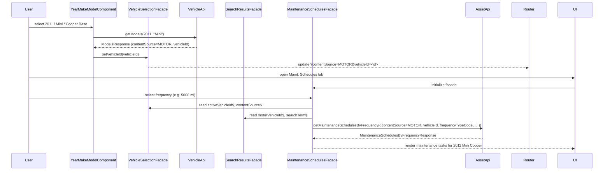
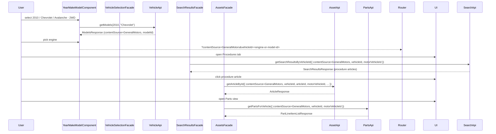

# M1 Connector ↔ api.motor.com Mapping

This document maps the **M1 connector** (sites.motor.com/m1) to the **MOTOR DaaS API** (api.motor.com/v1) from the [Swagger documentation](https://api.motor.com/v1/documentation/swagger).

## Architecture Overview

| System | Base URL | Auth | Purpose |
|--------|----------|------|---------|
| **M1 Connector** | `https://sites.motor.com/m1` | EBSCO session cookies | Web app API used by vehapi proxy & crawler |
| **MOTOR DaaS API** | `https://api.motor.com/v1` | Token (POST /Token) | Official REST API (Swagger) |

**Important:** The M1 connector and api.motor.com are **different entry points**. The vehapi proxy forwards to `sites.motor.com/m1`, not to `api.motor.com`. The proxy includes path rewrites for Chek-Chart–style paths so clients using that format can be translated to M1 paths before forwarding.

---

## 1. Vehicle Hierarchy Mapping

### Chek-Chart (api.motor.com) → M1 (sites.motor.com/m1)

The proxy's `pathRewrite` in `vehapiproxi/src/function.js` maps:

| api.motor.com Path | M1 Path |
|-------------------|---------|
| `/v1/Information/Chek-Chart/Years` | `/api/years` |
| `/v1/Information/Chek-Chart/Years/{Year}/Makes` | `/api/year/{Year}/makes` |
| `/v1/Information/Chek-Chart/Years/{Year}/Makes/{MakeCode}/Models` | `/api/year/{Year}/make/{MakeCode}/models` |
| `/v1/Information/Chek-Chart/Years/{Year}/Makes/{MakeCode}/Models/{ModelCode}/Engines` | *(Not in proxy; M1 returns engines in models response)* |
| `GetVehiclesByChekChart` → VehicleID | M1 `vehicle_id` (string) |

### Vehicle ID Formats

| API | Format | Example |
|-----|--------|---------|
| **api.motor.com** | Integer `BaseVehicleID` or `VehicleID` | `22123`, `61004` |
| **M1 (Ford-style)** | `year:make:model` (string, may be URL-encoded) | `2010:Ford:F-150` |
| **M1 (MOTOR-style)** | `modelId:engineId` from `engines[0].id` | `685:12345` |

M1 uses **content sources** (Ford, MOTOR, GeneralMotors) to route; api.motor.com uses `AttributeType` (BaseVehicleID/VehicleID) and `AttributeStandard` (MOTOR/VCDB).

---

## 2. Content Endpoint Mapping

### M1 Endpoints → Swagger Equivalents

| M1 Path | Swagger Equivalent | Content Type |
|---------|--------------------|--------------|
| `/api/source/{source}/vehicle/{vid}/articles/v2` | Aggregated from multiple Swagger endpoints | ServiceProcedures, WiringDiagrams, ComponentLocations, etc. |
| `/api/source/{source}/vehicle/{vid}/fluids` | `Content/Summaries/Of/Fluids` or `Content/Details/Of/Fluids/{ApplicationID}` | Fluids |
| `/api/source/{source}/vehicle/{vid}/parts` | `Content/Summaries/Of/Parts` or `Content/Details/Of/Parts/{ApplicationID}` | Parts |
| `/api/source/{source}/vehicle/{vid}/labor/{articleId}` | `Content/Details/Of/EstimatedWorkTimes/{ApplicationID}` | EstimatedWorkTimes |
| `/api/source/{source}/vehicle/{vid}/maintenanceSchedules/frequency` | `Content/Details/Of/MaintenanceSchedules/FrequencyTypes/{Code}` | MaintenanceSchedules |
| `/api/source/{source}/vehicle/{vid}/maintenanceSchedules/intervals` | `Content/Details/Of/MaintenanceSchedules/Timeline/At/{IntervalType}/{Value}` | MaintenanceSchedules |
| `/api/source/{source}/vehicle/{vid}/maintenanceSchedules/indicators` | `Content/Summaries/Of/MaintenanceSchedules/Indicators` | MaintenanceSchedules |
| `/api/source/{source}/vehicle/{vid}/article/{articleId}` | `Content/Details/Of/ServiceProcedures/{ApplicationID}` + Documents | ServiceProcedures |

### Swagger Path Structure

```
/Information/Vehicles/Attributes/{AttributeType}/{AttributeID}/Content/
  Summaries/Of/{ContentType}           → List applications
  Details/Of/{ContentType}/{ApplicationID}  → Full details
  Documents/Of/{ContentType}/{DocumentID}    → Binary (PDF, images)
  Taxonomies/Of/{ContentType}           → Taxonomy drill-down
```

`AttributeType` = `BaseVehicleID` or `VehicleID`  
`AttributeID` = integer (e.g. `22123`)

---

## 3. Additional Data Available in Swagger (Not Yet in M1 Crawler)

If you had **api.motor.com** credentials, these Swagger endpoints expose data not currently crawled via M1:

| Swagger Content Type | Endpoint Pattern | Description |
|----------------------|------------------|-------------|
| **DiagnosticTroubleCodes** | `Content/Summaries/Of/DiagnosticTroubleCodes` | DTC codes and supporting tests |
| **TechnicalServiceBulletins** | `Content/Summaries/Of/TechnicalServiceBulletins` | TSBs by issuer, type |
| **Specifications** | `Content/Summaries/Of/Specifications` | Specs (brake, tune-up, alignment, etc.) |
| **PartVectorIllustrations** | `Content/Summaries/Of/PartVectorIllustrations` | Exploded diagrams |
| **VehicleImages** | `Content/Details/Of/VehicleImages` | Vehicle images index |
| **RecommendedFluids** | `Content/Summaries/Of/RecommendedFluids` | Custom fluid recommendations |
| **Commercial Parts Interchange** | `/Information/Content/CommercialPartsInterchange/*` | Cross-reference search |
| **VMRS Codes** | `Content/VMRS/Of/EstimatedWorkTimes` | VMRS codes for labor |
| **PCDB Parts** | `PCDB/Details/Of/Parts` | Part details by part number |

### Reference Endpoints (Metadata)

| Endpoint | Purpose |
|----------|---------|
| `/Information/Content/Details/Of/ContentSilos` | Content silo IDs and names |
| `/Information/Content/Details/Of/AppRelationTypes` | Application relation types |
| `/Information/Content/Details/Of/Taxonomies/By/ContentSilos` | Taxonomy by silo |
| `/Information/Content/Details/Of/Specifications/Abbreviations` | Spec abbreviations |

---

## 4. Content Silo IDs (from Swagger)

Used in `ContentSilos` query param for filtering:

| ID | Silo Name |
|----|-----------|
| 1,3,4,5,6,8,10,11,13,16–27,37,39–41,43,44,46,48,51,115,122 | Service Procedures (various categories) |
| 12 | Component Location Diagrams |
| 28 | Mechanical Repair Labor (GEN5) |
| 29 | Mechanical Repair Parts (GEN5) |
| 33 | Preventative Maintenance Schedules |
| 56 | Wiring Diagrams |
| 102 | HD Maintenance Schedules |
| 103 | HD Estimated Work Times |
| 42 | Technical Service Bulletins |
| 15 | Diagnostic Trouble Codes |

---

## 5. Using api.motor.com Directly

To call api.motor.com you would need:

1. **Authentication**: `POST https://api.motor.com/v1/Token` (returns token)
2. **Vehicle resolution**: Use Chek-Chart or YMME hierarchy to get `BaseVehicleID` / `VehicleID`
3. **Content requests**: `GET /Information/Vehicles/Attributes/BaseVehicleID/{id}/Content/...`

The M1 connector abstracts this: it uses EBSCO auth, content sources, and string vehicle IDs. The internal mapping from M1 `vehicle_id` to MOTOR `BaseVehicleID`/`VehicleID` is not exposed.

---

## 6. Crawler Enhancement Opportunities

### Via M1 (sites.motor.com/m1) – Current Access

- **Already crawled**: articles_v2, procedures, wiring_diagrams, component_locations, labor, fluids, parts, maintenance_frequency, maintenance_intervals
- **M1 endpoints not yet in crawler**:
  - `/api/source/{source}/{id}/name` – vehicle display name (path uses `{id}` NOT `vehicle/{vid}`; see §7)
  - `/api/source/{source}/{modelId}/motorvehicles` – motor vehicle list (engines) for GM
  - `/api/source/{source}/vehicle/{vid}/article/{articleId}/title` – article title (dedicated endpoint)
  - `/api/source/{source}/vehicle/{vid}/article/{articleId}/orientations` – article orientations
  - `/api/source/{source}/vehicle/{vid}/maintenanceSchedules/indicators` – maintenance indicators
  - `/api/ui/banner.html` – UI banner (optional)
  - `/api/assets/locale/locale.properties` – PDF viewer locale (optional)

---

## 7. Source-Specific Routing (from M1 UI Network Capture)

The M1 UI uses **different path patterns** per content source. The crawler currently assumes a single pattern.

### Authoritative content sources (from M1 frontend source)

From the exported M1 Angular frontend (`ContentSource` enum), the connector recognizes these sources:

- `MOTOR`
- `GeneralMotors`
- `Honda`
- `Stellantis`
- `Toyota`
- `Nissan`
- `Ford`
- `ToyotaDelta`

These are the **only** content source strings you should assume exist unless the backend adds more.

### MOTOR (Toyota, Honda, Suzuki, etc.)

| Endpoint | Path Pattern | Example |
|----------|--------------|---------|
| Name | `/api/source/MOTOR/{modelId:engineId}/name` | `.../MOTOR/5191%3A264/name` |
| Parts | `/api/source/MOTOR/vehicle/{modelId:engineId}/parts` | `.../vehicle/5191%3A264/parts` |
| Articles | `/api/source/MOTOR/vehicle/{modelId:engineId}/articles/v2` | `.../vehicle/5191%3A264/articles/v2` |

- Uses `modelId:engineId` (e.g. `5191:264`) in path.
- No `motorVehicleId` query param.

### GeneralMotors (Chevrolet, Cadillac, etc.)

| Endpoint | Path Pattern | Example |
|----------|--------------|---------|
| Name | `/api/source/GeneralMotors/{modelId}/name` | `.../GeneralMotors/3705/name` |
| Motor vehicles | `/api/source/GeneralMotors/{modelId}/motorvehicles` | `.../3705/motorvehicles` |
| Parts | `/api/source/GeneralMotors/vehicle/{modelId}/parts?motorVehicleId={engineId}` | `.../vehicle/3705/parts?motorVehicleId=79612%3A3016` |
| Articles | `/api/source/GeneralMotors/vehicle/{modelId}/articles/v2?motorVehicleId={engineId}` | `.../vehicle/3705/articles/v2?motorVehicleId=79612%3A3016` |
| Labor | `/api/source/GeneralMotors/vehicle/{modelId}/labor/{articleId}?motorVehicleId={engineId}` | `.../vehicle/3705/labor/L%3A26896306?motorVehicleId=79612%3A3016` |
| Article | `/api/source/GeneralMotors/vehicle/{modelId}/article/{articleId}?motorVehicleId={engineId}&bucketName=...` | `.../vehicle/3705/article/2768763%3A5741910?motorVehicleId=79612%3A3016&bucketName=...` |

- **Path uses model ID** (e.g. `3705`), **not** engine ID.
- **Engine-specific data** requires `motorVehicleId` query param (e.g. `79612:3016`).
- Crawler may be using engine ID in path for GM, which could cause 500s.

### Shared endpoint contracts (from generated frontend API client)

The frontend calls these M1 endpoints (paths are stable; query params are optional unless noted):

#### Vehicle hierarchy

- `GET /api/years`
- `GET /api/year/{year}/makes`
- `GET /api/year/{year}/make/{make}/models` (**models response carries `contentSource`**)
- `GET /api/vin/{vin}/vehicle`
- `GET /api/motor/year/{year}/make/{make}/models` (motor models list)

#### Content (most sources)

- `GET /api/source/{contentSource}/{vehicleId}/name`
- `GET /api/source/{contentSource}/{vehicleId}/motorvehicles`
  - Used to resolve engine-specific `motorVehicleId` (notably for `GeneralMotors`)
- `GET /api/source/{contentSource}/vehicle/{vehicleId}/articles/v2`
  - Query: `searchTerm?`, `motorVehicleId?`
- `GET /api/source/{contentSource}/vehicle/{vehicleId}/parts`
  - Query: `motorVehicleId?`, `searchTerm?`
- `GET /api/source/{contentSource}/vehicle/{vehicleId}/article/{articleId}`
- `GET /api/source/{contentSource}/vehicle/{vehicleId}/article/{articleId}/title`
- `GET /api/source/{contentSource}/vehicle/{vehicleId}/labor/{articleId}`
- `GET /api/source/{contentSource}/graphic/{id}` (query `w`, `h`)
- `GET /api/asset/{handleId}`

#### Maintenance schedules

- `GET /api/source/{contentSource}/vehicle/{vehicleId}/maintenanceSchedules/frequency`
- `GET /api/source/{contentSource}/vehicle/{vehicleId}/maintenanceSchedules/intervals`
- `GET /api/source/{contentSource}/vehicle/{vehicleId}/maintenanceSchedules/indicators`

#### ToyotaDelta special-case

Toyota Delta uses a distinct search endpoint:

- `GET /api/source/{contentSource}/vehicle/{vehicleId}/toyotadeltaarticles`
  - Query: `searchTerm?`, `sourceQuarter?`, `targetQuarter?`

If Toyota Delta mode is active (frontend does this when both `sourceQuarter` and `targetQuarter` are set), the UI forces:

- `contentSource = ToyotaDelta`
- endpoint = `toyotadeltaarticles` (instead of `articles/v2`)

#### Track-change / delta report (not vehicle content)

- `GET /api/source/track-change/processingquarters`
- `GET /api/source/track-change/deltareport`
- `GET /api/source/{contentSource}/vehicle/{vehicleId}/delta-article/{articleId}`
- `GET /api/source/{contentSource}/vehicle/{vehicleId}/delta-article/{articleId}/title`

---

## 8. How to consume per content source (from frontend behavior)

The frontend treats `MOTOR` differently from other sources when selecting a vehicle:

- **If `contentSource == MOTOR`**
  - Selecting a model directly sets `vehicleId` and proceeds.
  - API calls generally do **not** use `motorVehicleId`.

- **If `contentSource != MOTOR`** (e.g. `GeneralMotors`, `Ford`, `Honda`, `Nissan`, `Stellantis`, `Toyota`)
  - Selecting a model triggers a second fetch:
    - `GET /api/source/{contentSource}/{vehicleId}/motorvehicles`
  - User then selects an engine; the selected engine ID is stored as `motorVehicleId`.
  - Subsequent content calls may include `motorVehicleId` as a query param (notably `articles/v2` and `parts`).

This matches the GM pattern observed in network captures where `vehicleId` is a model-level ID and `motorVehicleId` selects the engine/variant.

### Article Endpoints (both sources)

| Endpoint | Purpose |
|----------|---------|
| `/article/{articleId}?bucketName=...&articleSubtype=&searchTerm=` | Full article content |
| `/article/{articleId}/title` | Article title only (forkJoin in UI; one failed for `2768763:5741910`) |

### Via api.motor.com – Requires Different Auth

- DTCs, TSBs, Specifications, PartVectorIllustrations, VehicleImages, RecommendedFluids
- Commercial Parts Interchange, VMRS, PCDB
- Reference data (ContentSilos, Taxonomies, Abbreviations)

---

## 9. Frontend consumption wiring (file-by-file)

This section summarizes how the M1 Angular frontend (export in `C:\Users\mAdmin\Downloads\motor`) consumes the endpoints above.
Each bullet points to the authoritative places in the UI code for a given behavior.

### 9.1 Generated API clients (`src/src/app/generated/api/services/*.ts`)

- **`vehicle-api.ts`**
  - Vehicle hierarchy & IDs:
    - `GET /api/years`
    - `GET /api/year/{year}/makes`
    - `GET /api/year/{year}/make/{make}/models` → **models response carries `contentSource`**
    - `GET /api/motor/year/{year}/make/{make}/models` (Motor-only models list)
  - Per-source vehicle lookups:
    - `POST /api/source/{contentSource}/vehicles` (`GetVehiclesRequest.vehicleIds[]`)
    - `GET /api/source/{contentSource}/{vehicleId}/motorvehicles` → engine list; feeds `motorVehicleId`
    - `GET /api/source/{contentSource}/{vehicleId}/name` → display name

- **`search-api.ts`**
  - Standard search:
    - `GET /api/source/{contentSource}/vehicle/{vehicleId}/articles/v2?searchTerm&motorVehicleId`
  - Toyota Delta:
    - `GET /api/source/{contentSource}/vehicle/{vehicleId}/toyotadeltaarticles?searchTerm&sourceQuarter&targetQuarter`
    - Frontend forces `contentSource=ToyotaDelta` when both quarters are set.

- **`asset-api.ts`**
  - Articles & labor:
    - `GET /api/source/{contentSource}/vehicle/{vehicleId}/article/{articleId}?motorVehicleId&bucketName&articleSubtype&searchTerm`
    - `GET /api/source/{contentSource}/vehicle/{vehicleId}/labor/{articleId}?motorVehicleId&searchTerm`
  - Titles & orientations:
    - `GET /api/source/{contentSource}/vehicle/{vehicleId}/article/{articleId}/title`
    - `GET /api/source/{contentSource}/vehicle/{vehicleId}/article/{articleId}/orientations`
  - Graphics & raw XML:
    - `GET /api/source/{contentSource}/graphic/{id}?w&h`
    - `GET /api/asset/{handleId}`
    - `GET /api/source/{contentSource}/xml/{articleId}`
  - Maintenance:
    - `GET /api/source/{contentSource}/vehicle/{vehicleId}/maintenanceSchedules/frequency?frequencyTypeCode&severity&searchTerm`
    - `GET /api/source/{contentSource}/vehicle/{vehicleId}/maintenanceSchedules/intervals?intervalType&interval&severity&searchTerm`
    - `GET /api/source/{contentSource}/vehicle/{vehicleId}/maintenanceSchedules/indicators?severity&searchTerm`

- **`parts-api.ts`**
  - Parts:
    - `GET /api/source/{contentSource}/vehicle/{vehicleId}/parts?motorVehicleId&searchTerm`
  - For non-`MOTOR` sources, callers typically obtain `motorVehicleId` via `/motorvehicles` first.

- **`track-change-api.ts`**
  - Track-change / delta report:
    - `GET /api/source/track-change/processingquarters`
    - `GET /api/source/track-change/deltareport`
    - `GET /api/source/{contentSource}/vehicle/{vehicleId}/delta-article/{articleId}`
    - `GET /api/source/{contentSource}/vehicle/{vehicleId}/delta-article/{articleId}/title`

- **`ui-api.ts`**
  - UI-only helpers used by the app shell:
    - `GET /api/ui/favicon`
    - `GET /api/ui/css/bootstrap`
    - `GET /api/ui/banner.html`
    - `GET /api/ui/usersettings`
    - `GET /api/ui/feedbackconfigurations`
    - `POST /api/ui/savefeedback`

- **`bookmark-api.ts`**
  - Bookmarks:
    - `POST /api/source/{contentSource}/vehicle/{vehicleId}/article/{articleId}/bookmark`
    - `GET /api/bookmark/{bookmarkId}`

- **`error-logging-api.ts`**
  - Error logging:
    - `POST /api/logError`

### 9.2 State facades and components (frontend orchestration)

- **`vehicle-selection/state/state/vehicle-selection.facade.ts`**
  - Orchestrates vehicle selection across routes and session storage.
  - Reads `contentSource`, `vehicleId`, `motorVehicleId` from query params.
  - For **non-MOTOR** sources:
    - Calls `VehicleApi.getMotorVehicleDetails` to fetch `motorVehicleId` candidates.
    - If there is a single engine, writes `motorVehicleId` into the URL automatically.
  - Keeps a recent-vehicles list in `sessionStorage` with `{ vehicleId, contentSource, motorVehicleId }`, which feeds the “Recent Vehicles” dropdown in the M1 UI.

- **`search/state/search-results.facade.ts`**
  - Combines:
    - `contentSource$`, `activeVehicleId$`, `motorVehicleId$`
    - `searchTerm$`, `sourceQuarter$`, `targetQuarter$`
  - Standard mode:
    - Calls `SearchApi.getSearchResultsByVehicleId` (articles/v2) with `motorVehicleId` when present.
  - Toyota Delta mode:
    - When both quarters are set, calls `SearchApi.getSearchResultsByVehicleIdForToyotaDelta` with `contentSource=ToyotaDelta`.

- **`maintenance-schedules/state/maintenance-schedules.facade.ts`**
  - Wires the Maintenance Schedules view to:
    - `AssetApi.getMaintenanceSchedulesByFrequency`
    - `AssetApi.getMaintenanceSchedulesByInterval`
    - `AssetApi.getIndicatorsWithMaintenanceSchedules`
  - Uses the same `(contentSource, vehicleId, motorVehicleId?)` tuple defined above.

- **`assets/state/assets.facade.ts`**
  - Central place where:
    - `AssetApi.getArticleById`
    - `AssetApi.getLaborDetails`
    - `AssetApi.getGraphic`
  - are invoked based on current selection (vehicle + article id).

- **`delta-report/delta-report.component.ts`**
  - Consumes `TrackChangeApi` endpoints to:
    - fetch processing quarters,
    - request delta reports (`deltareport`),
    - navigate into delta articles (`delta-article`).

- **`vehicle-selection/components/year-make-model/year-make-model.component.ts`**
  - UI wrapper over `VehicleApi.getYears/getMakes/getModels/getMotorModels`.
  - Feeds `VehicleSelectionFacade` with selected `(year, make, model)` which becomes `(contentSource, vehicleId, motorVehicleId?)`.

These references ensure that when the frontend behavior changes (new sources, new params, new endpoints), we can locate the change quickly and update this mapping and the Swagger specification in lockstep.

---

## 10. Sequence example – Maintenance Schedules (2011 Mini Cooper)

This example traces **exactly which endpoints are called** when a user opens the *Maintenance Schedules* tab and selects a frequency, using the M1 frontend behavior.

Assumptions:
- Year: **2011**
- Make: **Mini**
- Model: **Cooper Base**
- `contentSource = MOTOR` (from `getModels` response)
- No `motorVehicleId` needed for MOTOR (vehicleId already encodes engine)

### 10.1 High-level steps

1. **Vehicle selection (Year / Make / Model)**
   - `YearMakeModelComponent` calls `VehicleApi.getModels(2011, "Mini")`.
   - Response body contains:
     - `contentSource = "MOTOR"`
     - `vehicleId` for "Cooper Base".
   - `VehicleSelectionFacade.setVehicleId(vehicleId)` updates router query params:
     - `?contentSource=MOTOR&vehicleId=<opaque-id>`
   - `VehicleSelectionFacade` writes a `SelectedVehicle` entry to `sessionStorage`
     so it appears in the **Recent Vehicles** dropdown.

2. **Search subscription (All tab / Procedures tab, etc.)**
   - `SearchResultsFacade` sees `(contentSource=MOTOR, vehicleId=<id>, motorVehicleId=undefined, searchTerm="")`
     and calls:
     - `SearchApi.getSearchResultsByVehicleId({ contentSource: MOTOR, vehicleId, searchTerm: "", motorVehicleId: undefined })`
   - This loads the article buckets (Procedures, Diagrams, etc.) but is independent of Maintenance Schedules.

3. **User opens *Maint. Schedules* tab**
   - UI route changes to `/docs/Maint. Schedules` with the same query params:
     - `?contentSource=MOTOR&vehicleId=<id>`
   - `MaintenanceSchedulesFacade` becomes active and listens to:
     - `VehicleSelectionFacade.activeVehicleId$`
     - `VehicleSelectionFacade.contentSource$`
     - `SearchResultsFacade.motorVehicleId$`
     - `SearchResultsFacade.searchTerm$`

4. **User chooses a frequency (e.g. 5,000 mi / 6 months)**
   - UI calls `MaintenanceSchedulesFacade.searchByFrequency(frequencyTypeCode="Miles", severity?, ...)`.
   - `searchByFrequency` performs:
     1. `combineLatest([activeVehicleId$, motorVehicleId$, contentSource$, searchTerm$]).pipe(take(1))`
     2. Validates:
        - `contentSource` is defined
        - `vehicleId` is defined
        - If `contentSource !== MOTOR` then `motorVehicleId` must be present
     3. Calls:
        ```ts
        assetApi.getMaintenanceSchedulesByFrequency({
          contentSource: ContentSource.Motor,
          vehicleId: motorVehicleId ? motorVehicleId : vehicleId,
          frequencyTypeCode,
          severity,
          searchTerm,
        })
        ```
        Note: for all sources the frontend currently uses `contentSource=Motor` here and passes either
        the `motorVehicleId` (non-MOTOR) or the `vehicleId` (MOTOR) as the `vehicleId` argument.
     4. On success, `MaintenanceSchedulesFacade` pushes:
        - `pmsstResponse.body.applications` into `maintenanceSchedulesByFrequency$`
        keyed by `frequencyTypeCode`.

5. **User switches to interval view (e.g. 30,000 mi)**
   - UI calls `MaintenanceSchedulesFacade.searchByInterval(intervalType="Miles", interval=30000, severity?, ...)`.
   - Flow is identical to frequency search, except it calls:
     ```ts
     assetApi.getMaintenanceSchedulesByInterval({
       contentSource: ContentSource.Motor,
       vehicleId: motorVehicleId ? motorVehicleId : vehicleId,
       intervalType,
       interval,
       severity,
       searchTerm,
     })
     ```
   - `MaintenanceSchedulesByIntervalStore` is updated with the returned interval schedules.

6. **User expands Maintenance Schedules indicators**
   - UI calls `MaintenanceSchedulesFacade.searchByIndicators(severity?)`.
   - The facade again validates `(contentSource, vehicleId, motorVehicleId)` and calls:
     ```ts
     assetApi.getIndicatorsWithMaintenanceSchedules({
       contentSource: ContentSource.Motor,
       vehicleId: motorVehicleId ? motorVehicleId : vehicleId,
       severity,
       searchTerm,
     })
     ```
   - `MaintenanceSchedulesByIndicatorStore` is populated with the returned indicator list.

### 10.2 Sequence diagram (simplified)



For non-MOTOR sources the same flow applies, except:
- `contentSource` is an OEM value (e.g. `GeneralMotors`, `Ford`, `Stellantis`).
- `VehicleSelectionFacade` must first fetch and select a `motorVehicleId` via `/motorvehicles`.
- `MaintenanceSchedulesFacade` passes that `motorVehicleId` as the `vehicleId` argument to the maintenance endpoints.

---

## 11. Sequence example – GM Procedure + Parts (with motorVehicleId)

This example traces the flow for a **General Motors** vehicle where `vehicleId`
is model-level and an engine-specific `motorVehicleId` is required.

Assumptions:
- Year: **2010**
- Make: **Chevrolet**
- Model: **Avalanche - 2WD**
- `contentSource = GeneralMotors` (from `getModels` response)
- User opens a **procedure article**, then loads **related parts**.

### 11.1 High-level steps

1. **Vehicle selection (Year / Make / Model)**
   - `YearMakeModelComponent` calls:
     - `VehicleApi.getModels(2010, "Chevrolet")`
   - Models response contains:
     - `contentSource = "GeneralMotors"`
     - a model-level `vehicleId` for "Avalanche - 2WD".
   - User picks "Avalanche - 2WD":
     - Because this GM model has **engines**, `setModel` populates `engines` and:
       - either auto-selects when there is 1 engine, or shows a list.
   - User picks an engine:
     - `setEngine(engine)` navigates to:
       - `/docs/All?contentSource=GeneralMotors&vehicleId=<engineId>`
       - In practice for GM, the frontend uses the engine id as `vehicleId` on docs,
         while server-side still expects `modelId` in the path and `motorVehicleId`
         as a query param (the proxy normalizes this).

2. **Search subscription (All / Procedures tab)**
   - `SearchResultsFacade` sees:
     - `contentSource=GeneralMotors`
     - `vehicleId=<engine-or-model-id>`
     - `motorVehicleId` (if present in query params)
   - It calls:
     ```ts
     SearchApi.getSearchResultsByVehicleId({
       contentSource: ContentSource.GeneralMotors,
       vehicleId,
       searchTerm: '',
       motorVehicleId, // required for true engine specificity
     })
     ```
   - This populates the Procedures bucket with GM procedure articles.

3. **User opens a procedure article**
   - User clicks a procedure row in the All/Procedures tab.
   - Router updates `articleIdTrail` and `bookmarkId` query params.
   - `AssetsFacade` observes the active article id and calls:
     ```ts
     AssetApi.getArticleById({
       contentSource: ContentSource.GeneralMotors,
       vehicleId,
       articleId,
       motorVehicleId,
       bucketName,     // e.g. "Procedures"
       articleSubtype, // optional
       searchTerm: '', // carried through from search
     })
     ```
   - The GM backend uses:
     - `vehicleId` (model ID) in the path
     - `motorVehicleId` to select the specific engine publication
     - `bucketName`/`articleSubtype` to route into the correct silo.

4. **User navigates to related parts**
   - The same `(contentSource, vehicleId, motorVehicleId)` triple is reused.
   - `AssetsFacade`’s `vehiclePartsApiTrigger$` reacts to:
     - `contentSource$`, `activeVehicleId$`, `motorVehicleId$`
   - It validates:
     - `contentSource` defined
     - `vehicleId` defined
     - for GM (`contentSource !== MOTOR`), `motorVehicleId` must be present.
   - Then calls:
     ```ts
     PartsApi.getPartsForVehicle({
       contentSource: ContentSource.GeneralMotors,
       vehicleId,
       motorVehicleId,
       searchTerm: '', // or the current search term
     })
     ```
   - The GM backend again uses:
     - `vehicleId` (model ID) path component
     - `motorVehicleId` query parameter to filter to the specific engine.

### 11.2 Sequence diagram (simplified)



This sequence shows how **GM** (and other non‑MOTOR sources) rely on the combination
of `vehicleId` (model-level) and `motorVehicleId` (engine-level) across **search,
article, labor, and parts** endpoints.

---

## 12. Sequence example – Track Change / Delta Report

This example traces how the **Delta Report** UI pulls track-change data and drives
navigation into delta articles.

Assumptions:
- User opens the **Delta Report** screen (separate from the docs view).
- They pick a `quarter` and then drill into a vehicle’s delta articles.

### 12.1 High-level steps

1. **Load vehicle delta report grid**
   - `DeltaReportComponent.ngOnInit` calls:
     ```ts
     TrackChangeApi.getVehicleDeltaReport()
     ```
   - This hits:
     - `GET /api/source/track-change/deltareport`
   - Response body is mapped into `VehicleDeltaReportView` rows:
     - `year`, `make`, `model`, `sourceQuarter`, `targetQuarter`, and article counts.

2. **User filters by Year / Make / Model / Quarters**
   - All filtering is done client-side on the `VehicleDeltaReportView` stream.
   - No extra API calls are made until the user clicks **Open**.

3. **User clicks “Open” for a given row**
   - `DeltaReportComponent.viewDocs(row)`:
     - Builds a docs URL with:
       - `year`, `make`, `model`
       - `sourceQuarter`, `targetQuarter`
     - Navigates into the docs UI (e.g. `/docs/All?...`).
   - Once in docs:
     - `SearchResultsFacade` sees both quarters and enters **Toyota Delta mode** if appropriate.
     - `SearchApi.getSearchResultsByVehicleIdForToyotaDelta` and/or
       `TrackChangeApi.getDeltaArticleById/getDeltaArticleTitle` are then used
       when user opens individual delta articles.

### 12.2 Endpoints involved

- Grid data:
  - `GET /api/source/track-change/deltareport?quarter?` → `VehicleDeltaReportListResponse`
- Quarters (for drop-downs, if used in other screens):
  - `GET /api/source/track-change/processingquarters` → `StringListResponse`
- Individual delta articles (inside docs UI):
  - `GET /api/source/{contentSource}/vehicle/{vehicleId}/delta-article/{articleId}?quarter`
  - `GET /api/source/{contentSource}/vehicle/{vehicleId}/delta-article/{articleId}/title?quarter`

This sequence ties together the Track Change endpoints with the docs navigation,
so that future changes to track-change behavior can be cross-checked against
both the Swagger spec and the Angular components/facades.

---

## 13. Sequence example – Bookmarks (save & restore article)

This example shows how the frontend saves a bookmark for the **current article**
and later restores it by `bookmarkId`.

Assumptions:
- User has an article open in the docs UI.
- Query params include:
  - `contentSource`
  - `vehicleId`
  - `motorVehicleId?` (for non‑MOTOR sources)
  - `articleIdTrail` (the current article’s trail)

### 13.1 Saving a bookmark

1. **User clicks “Bookmark” while viewing an article**
   - The docs UI (via `AssetsFacade` + `BookmarkApi`) gathers:
     - `contentSource` (from router or `VehicleSelectionFacade`)
     - `vehicleId`
     - `articleId` (active article id)
     - `motorVehicleId?` (if present)
     - `title` and `bucketName` (from the current article metadata)
   - Frontend calls:
     ```ts
     BookmarkApi.saveBookmark({
       contentSource,
       vehicleId,
       articleId,
       // body: { motorVehicleId, title, bucketName } – see Swagger Bookmarks tag
     })
     ```
   - This hits:
     - `POST /api/source/{contentSource}/vehicle/{vehicleId}/article/{articleId}/bookmark`
     - JSON body contains at least `{ motorVehicleId?, title, bucketName }`.
   - Response:
     - `ArticleBookmarkResponse` including a `bookmarkId` (numeric) that can be
       stored client-side (e.g. in UI state or settings).

### 13.2 Restoring a bookmark

1. **User opens a bookmark (e.g. from a list)**
   - UI has a `bookmarkId` (from `ArticleBookmarkResponse`).
   - It calls:
     ```ts
     BookmarkApi.getBookmark({ bookmarkId })
     ```
   - This hits:
     - `GET /api/bookmark/{bookmarkId}`
   - Response:
     - `ArticleResponse` for the referenced article, including all metadata
       needed to navigate to the correct docs route.

2. **Navigate into docs**
   - UI uses the article response to reconstruct or update:
     - `contentSource`, `vehicleId`, `motorVehicleId?`
     - `articleIdTrail`
   - Then navigates to the docs view (`/docs/...`) with those query params,
     allowing the rest of the stack (VehicleSelectionFacade, SearchResultsFacade,
     AssetsFacade) to load the article as if the user had clicked it directly.

This sequence completes the picture for how bookmarks layer on top of the
existing article and vehicle-selection flows.

---

## References

- [MOTOR DaaS Swagger](https://api.motor.com/v1/documentation/swagger)
- Vehapiproxi Swagger: `oldfiles/documentation/vehapiproxi/swagger.yaml`
- M1 frontend (Angular) export: `C:\Users\mAdmin\Downloads\motor`
- M1 crawler: `randdev/m1_crawler/client.py`, `randdev/m1_crawler/crawler.py`
- Proxy config: `vehapiproxi/src/config.js`, `vehapiproxi/src/function.js` (pathRewrite)
- Extracted M1 endpoints: `randdev/m1_crawler/m1_endpoints.json`
